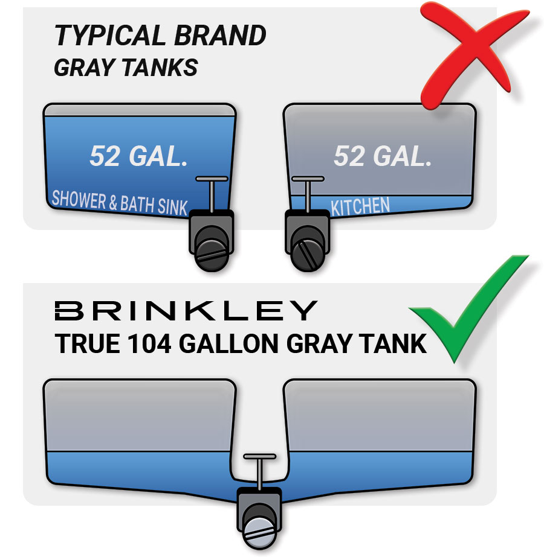

# True Gal

{ align=center}

## Upgraded Holding Tanks & True Capacities
We not only maximized the Model G’s holding tank capacities, but also designed the dual gray tanks so you can spend even more time camping. Unlike most RVs, ours have a single valve and are connected, equalizing the levels, giving you a true tank capacity!

|

| **TANK CAPACITY** | **3250** | **3500** | **3950** | **3970** | **4000** | **4100** |
|---------------|------|------|------|------|------|------|
| Fresh Water (gal.) | 150  | 150  | 150  | 150  | 150  | 150  |
| Gray Water (True gal.) | 156 (104 True + 52) | 104 True | 156 (104 True + 52) | 156 (104 True + 52) | 104 True | 156 (104 True + 52) |
| Black Water (gal.) | 52   | 104  | 85   | 85   | 104  | 85   |