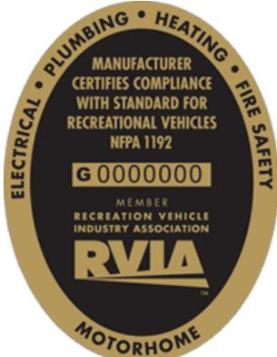

---

---

# SEC.01 **INTRODUCTION**

## A. ABOUT THIS MANUAL

The Brinkley RV Owner's Manual is intended to safely guide you through the proper use and maintenance of your Brinkley RV along with its unique components and features. Understanding the operational procedures of your Brinkley RV will allow you to better understand how to use your RV and, in turn, maximize your RV experience.

Please know, this manual is not intended to be inclusive of every and all operational aspects of your RV. The separate component and appliance owner's manuals should also be thoroughly reviewed. Because there are various options that may be selected within the build of each RV, each Brinkley RV may contain options, features, and/or components that are not included on your RV.

We wish that we could provide you with all the information required to ensure your safety during towing, transportation, and camping. The campsites you choose, your tow vehicle, and the road conditions you encounter along your journey are too numerous for us to cover all the potential scenarios.

!!! warning "Attention"
    **You are ultimately responsible for the safe use, operation, and transportation of your RV.**

If you have questions related to safety, please contact us. We will gladly provide you with additional guidance related to your specific camping and transportation scenarios.

Additionally, due to our dedication to continuous product improvements and updates, some photographs, components, systems, and diagrams may be different from what is supplied within this manual. If we can make our products better, we will strive to make those improvements as quickly as humanly possible.

!!! quote "Notice"
    **At the time of publication, this information is accurate, but is subject to change at any time without notice. You can access the most up to date version of the Owner's Manual by visiting our website, [www.BrinkleyRV.com or](http://www.BrinkleyRV.com) by scanning the QR code located on the back cover of this Owner's Manual.** 

If you happen to have any additional questions or concerns, or simply need assistance of any kind, please do not hesitate to reach out to your Brinkley RV Dealer or the Brinkley RV Customer Care Team. Below, you will find our contact information. Our contact information is also located at the bottom of each page of this manual. Remember, we are just one phone call away.

### **CONTACT INFORMATION:**

| Email:   | CustomerCare@BrinkleyRV.com                                                      |
|----------|----------------------------------------------------------------------------------|
| Phone:   | (574) 501-4280 or toll free (888) 502-3460                                    |
| Address: | Brinkley RV Attn: Customer Care 1655 Brinkley Way East Goshen, IN 46528 |

## B. OWNER INFORMATION PACKAGE

Within your RV, you will find an Owner's Information Package that contains the Owner's Manual, Warranty Guide, Component Manuals, and Warranty Registrations for the appliances and components within your new Brinkley RV.

- **Before Using Your RV,** it is vital you read all documents within the Owner's Information Package. Your safety is important to us, and we want you to have the best possible experience with your Brinkley RV.

!!! quote "Notice"
    **Some component manuals will not be provided within your Owner's Information Package and can only be found online via the component supplier website.**

- **Register and activate your component warranties** within the required time frame to avoid loss of warranty coverage. Please note that there are some component manufacturers who provide additional warranties beyond that of the Brinkley RV Limited Base and Structural Warranties. Please See **Section 4** in the separate Warranty Guide for additional details.

!!! quote "Notice"
    **It is highly recommended that you have your selling Dealer register your warranties. It is their obligation to register your warranties on your behalf at the time of sale. Failing to register your warranties may prevent you from utilizing the benefits of SafeRide prior to registration. See **Section 3(D)2**. Additionally, registering at the time of sale ensures that you are afforded the full benefit of all warranties.**

## C. MANUFACTURING CERTIFICATION

All Brinkley RVs are required to meet and/or exceed the safety and manufacturing codes, regulations, and standards of the Recreational Vehicle Industry Association (RVIA).

- RVIA and Transport Canada both conduct random product audits on a frequent basis to ensure that all Brinkley RV's are manufactured to U.S. (RVIA) and Canadian (CSA) standards.

- Depending on where the RV is being transported and sold, an RVIA and/or CSA Group label can be found on the sidewall next to the main entry door. This label confirms that your RV has been manufactured to the required codes and standards of RVIA and/or CSA.

!!! quote "Notice"
    The RVIA and CSA Codes and standards are not identical and can vary from each other depending on their requirements.

**Content within the Brinkley RV Owner's Information Package including the Owner's Manual, Warranty Guide, Component Manuals, etc. should be considered a permanent component of the RV. In the event this RV is traded or sold, all documents should remain within the RV for the next owner.** 

## D. VEHICLE IDENTIFICATION NUMBER
!!! quote inline end "Notice"
    The last seven (7) digits of the VIN are also known as the RV serial number. For example, using the supplied VIN below, the serial number would be **2000001**.a

Each Brinkley RV is assigned a 17-digit vehicle identification number also referred to as the "VIN." This identification number is located on the VIN tag which can be found on the A-frame of a travel trailer or the hitch (also known as the pin box) on fifth wheels. As a secondary location, the VIN can also be found on the Federal Certification Label See **Section 5C(3)**.

Please see the typical decoding of a Brinkley RV VIN below:

| SAE WORLD IDENTIFIER:     | CLASS:             | BRAND:      | LENGTH:                          | MODEL YEAR: |
|-------------------|--------------------|-------------|----------------------------------|-------------|
|                         | F = FIFTH WHEEL    | Z – MODEL Z | THIS NUMBER IS A GROUPING NUMBER | N – 2022    |
| 7TO – BRINKLEY RV | T = TRAVEL TRAILER | G – MODEL G | PREDETERMINED BASED ON THE       | P – 2023    |
|                   |                    |             | SPECIFIED GROUP THE RV LENGTH    | R – 2024    |
|                   |                    |             | FALLS WITHIN RATHER THAN THE     | S – 2025    |
|                   |                    |             | ACTUAL LENGTH OF THE RV.         |             |

## E. SAFETY PRECAUTIONS

There are many safety precautions you should be aware of and take while enjoying your RV. These include but are not limited to:

- **Safety during the transportation of our RV.**
- **Functional safety while utilizing all RV components and features.**
- **Environmental safety while visiting different locations.**
- **Occupant safety while staying in the RV over the course of your trip.**

Safety is, and should be, exercised in every aspect of your RV experience. The personal safety of you, your family, and those around you are of the greatest importance to us at Brinkley RV.

Many appliances and related equipment within the RV (stove, outdoor grills, generator, water heater, furnace, etc.) will operate utilizing propane and/or will exhaust carbon monoxide. While using these items or any other related potential safety hazard, it is crucial that safety remains your number one priority. Be sure to follow all instructions and warnings related to your RV referenced in this manual as well as each supplier's component manual. Below is a guide to the common safety related symbols utilized throughout this manual to ensure that you are aware of potential safety concerns:

!!! danger
    **This indicates an imminent hazard that, if not avoided or handled correctly, will result in death or serious injury.**

!!! warning
    **This indicates a potential hazard that, if not avoided or handled correctly, may result in death or serious injury.**

!!! caution
    **This indicates a potential hazard that, if not avoided or handled correctly, may result in minor or moderate injury.**

!!! quote "Notice"
    This is used to address best practices that should be utilized and do not commonly result in injury but may lead to property damage if not careful. Notices are also utilized throughout the manual to call attention to important information that you should be aware of.

# F. ADDITIONAL TERMINOLOGY USED 
**Customer Supplied**

Indicates any and all aftermarket items not installed, provided, or included with the RV as built by Brinkley RV. Any item deemed "Customer Supplied" is not covered under the Brinkley Limited Base Warranty or Limited Structural Warranty.

#### **If Equipped**

Indicates any and all items that may be included and/or installed by Brinkley on a particular RV. All items referred to with the phrase "If Equipped," must be installed during the manufacturing process and cannot be installed or added at a later date. The phrase "If Equipped" does not imply or suggest such items are available, supplied, or included with any given Brinkley RV.

#### **Optional**

Indicates any and all items that may be an option and/or feature added to a particular Brinkley RV. Some "Optional" items and/or features can only be installed within the manufacturing process and cannot be added as an aftermarket item. The term "Optional" does not imply or suggest such items are available, supplied, or included with any given Brinkley RV.

---

**BRINKLEY CUSTOMER CARE:** phone: [888.502.3460](tel:8885023460) or [574.501.4280](tel:5745014280) / email: [CustomerCare@BrinkleyRV.com](mailto:CustomerCare@BrinkleyRV.com)

**SAFERIDE 24/7 - EMERGENCY ROADSIDE ASSISTANCE:** [888.482.5715](tel:8884825715) / **Customer Service:** [855.963.1770](tel:8559631770)

---