# SEC.25 **ACCESSORIES**

## A. INTERIOR ACCESSORIES

Within your RV, there are many features and accessories to improve your experience. These features include a pull-out pantry and spice rack, hidden dog dishes, an extendable island, silverware drawer, and much more.

### **1. Pantry**

The design of the pantry was guided by weight limitations and not based on the volume of items. Please bear this in mind as you load and stock the pantry. To open the pantry, you will need to step on the release shown in the below photo and gently pull the handle to slide the pantry open.

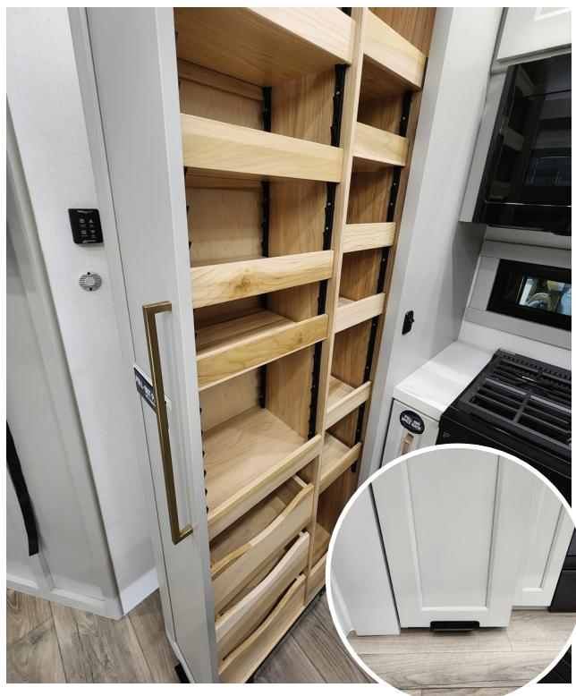

This pantry can be used to store items you wish to take with you as you travel. The shelves within the cabinets were designed for common camping items such as paper plates, napkins, cookware, plastic cups, dry goods, etc. all of which are not heavy or bulky. Prior to traveling, it is best to make sure all loaded items are fully secure.

!!! tip "TO ADJUST THE PANTRY SHELVES:"
    - 1. First determine the shelf you would like to adjust and its desire location.
    - 2. Locate the push levers on the shelving track and apply pressure to them. This will allow you to    move the shelf freely one side at a time.

    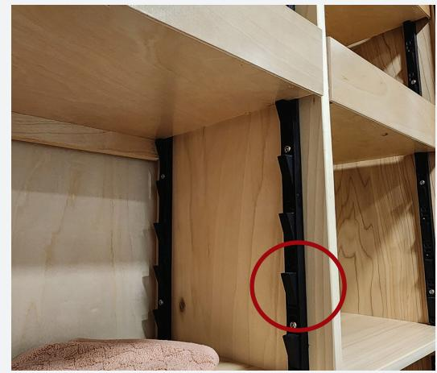

    - 3. Repeat this process on the opposing side.

### **2. Spice Rack**

Next to the pantry, you will find a spice rack. To open the spice rack, grab the handle and pull towards you to open. Below is the spice rack in its opened position.

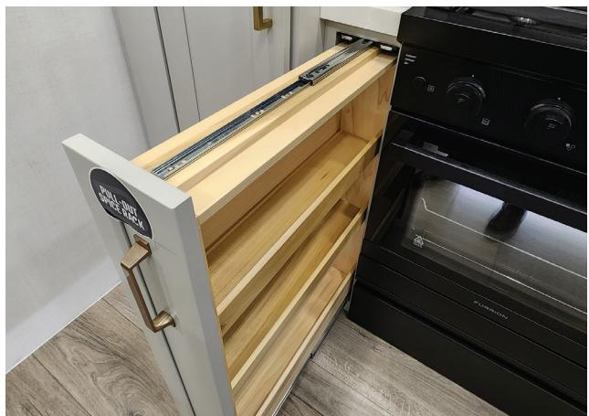

### **3. Silverware Drawer**

Your RV is equipped with a hidden silverware drawer. This drop down silverware drawer is recessed in an overhead cabinet in the kitchen area. Circled in red, you will find the location of the silverware drawer in the G3500.

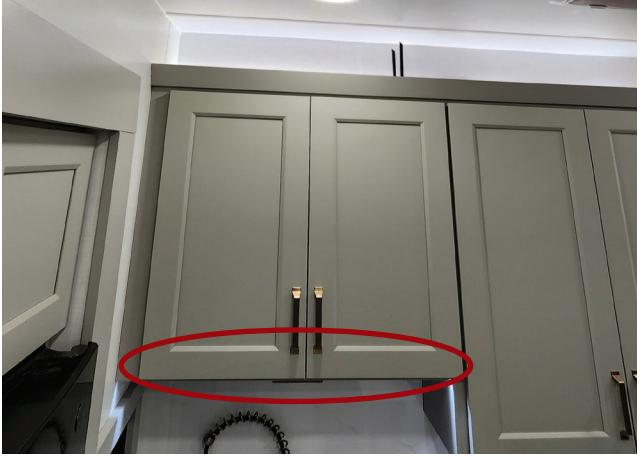

To operate, grab the handle and gently pull in a downward motion. This will allow the drawer to pivot open.

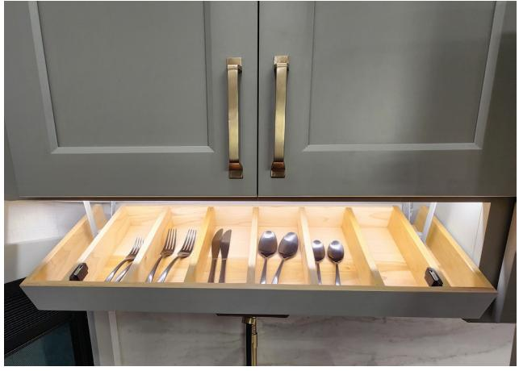

To close, simply push up on the handle until you feel the drawer seat into the closed position. Prior to traveling with your RV, it is important to make sure this drawer is properly closed.

### **4. Knife Drawer**

Your RV is equipped with a hidden, magnetized knife drawer. This drop down drawer is located in an overhead cabinet within the kitchen. Circled in red, you will find the location of the silverware drawer in the G3500.

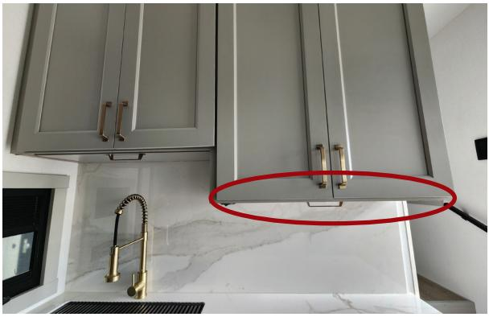

To operate, grab the handle and gently pull in a downward motion. This will allow the drop drawer to pivot open.

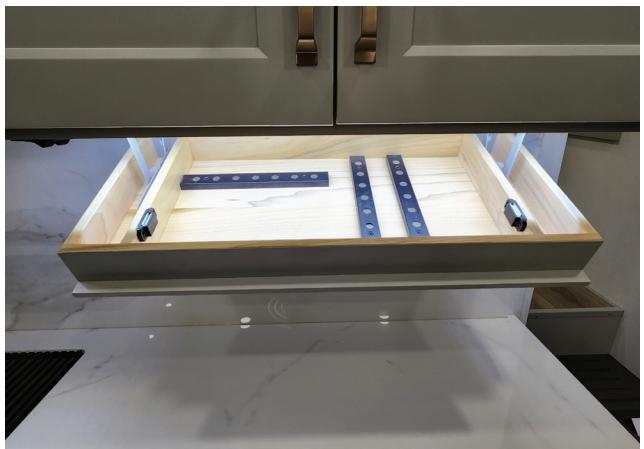

To close, simply push up on the handle until you feel the drawer seat into the closed position. Prior to traveling with your RV, it is important to make sure this drawer is properly closed.

### **5. Island Extension**

Your RV is equipped with an extendable island feature. The island extension is located on one of the short ends of the island. Below you can see what the closed position looks like.

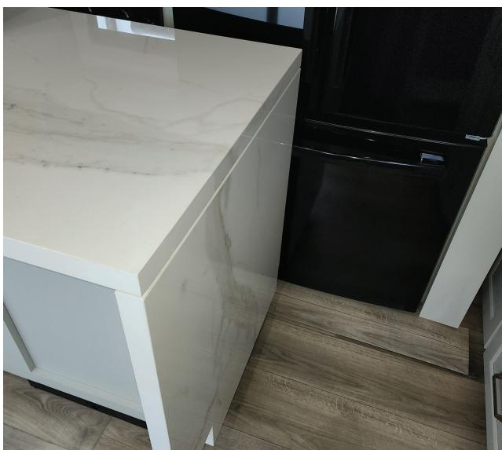

#### **EXTENDING THE ISLAND:**

- 1. Locate the extension found at one of the short ends of the island.
- 2. Grab the extension on both sides, near the top, and gently pull the top portion of the extension out. The extension will only slide-out about 2" (5.08 cm).

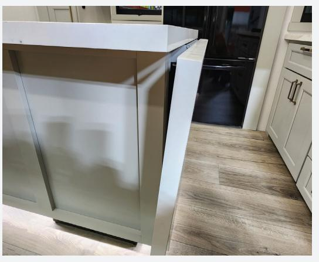

- 3. Pivot the extension top up so that it is parallel to the countertops.
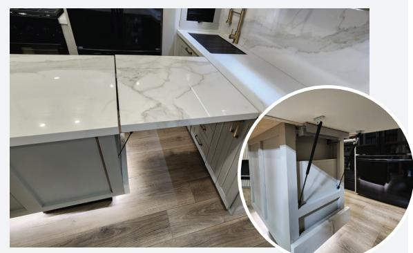

- 4. Once the extension is in position, locate the support plate and gently pull it out.
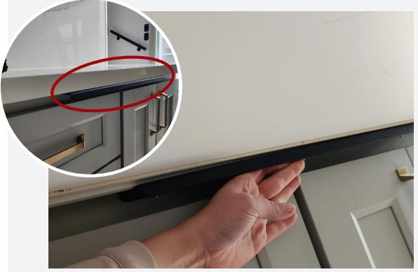

- 5. To stow away, repeat these steps in reverse.
### **6. Cutting Board**

Your RV is equipped with a cutting board that is stowed in the island on the side closest to the oven. As an example, the location of the cutting board in the G3500 is shown below.

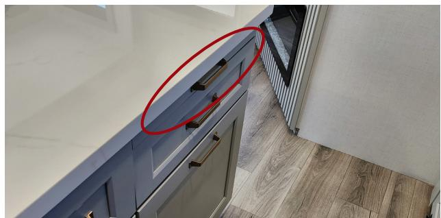

To open, grab the handle and gently pull out.

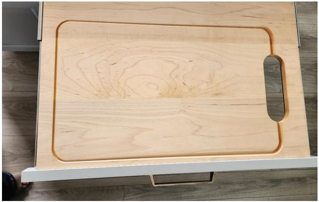

To close, push inward on the drawer front attached to the cutting board.

### **7. Pet Food Bowls—Integrated into the Kitchen Island**

Your RV is equipped with integrated pet water and food bowls. It is integrated into the steel base of the island.

Simply grab the front of the metal tray and pull it outward to reveal the pet bowls.

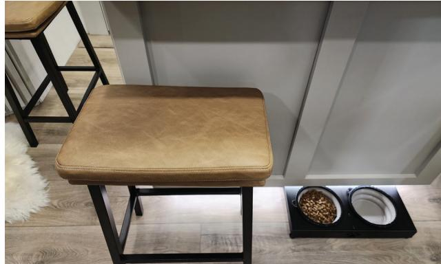

Push in on the front of the tray to close.

These bowls are removable for cleaning and collapsible for storage. The bowls need to be retracted and not contain food or water to retract the tray back into the island. Also be sure to remove all food and water from the bowls prior to travel to avoid spillage.

### **8. Bathroom Storage**

Your RV is equipped sliding storage within the bathroom. The upper storage is very similar in operation and design as the pantry. The lower storage is a slide-out trash can.

To open either storage area, you will first need to locate the center lock shown below and rotate it 90 degrees. This will allow the doors to freely open. Prior to travel, both storage doors need to be closed and the lock needs to be engaged.

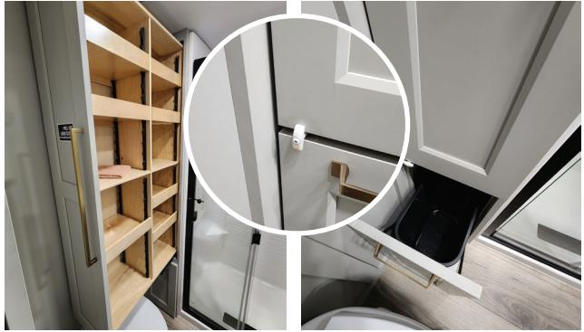

To adjust the shelving, please See **Section 25A(1)** for instructions.

### **9. Garage Hidden Storage**

Within the garage area, there is an in floor storage compartment. This compartment is recessed within the floor and can be locked and unlocked with a key.

Below is the compartment and its location. In the close up, you can see the lock and the compression latch. To open the compartment, unlock the latch and press down on the latch to release the door.

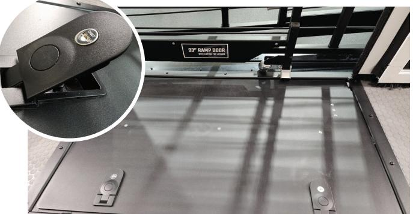

### **10. Recessed L-Track**

Within the garage area of your RV, you will notice tracks in the floor. These tracks are known as L-tracks and are used to assist in securing your vehicles and equipment. L-track accessories can be moved along the track depending on the need.

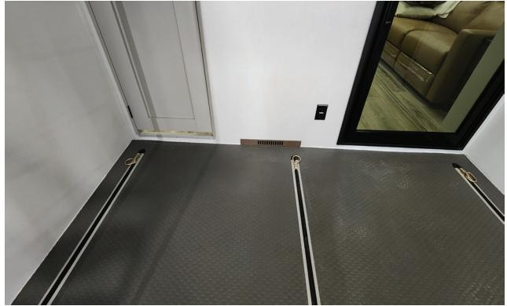

## B. EXTERIOR ACCESSORIES

Just like the inside of your RV, the outside holds many features and accessories for your convenience. These features range from air hose reels, to a mini fridge, to exterior LED lighting, and much more.

### **1. Mini Refrigerator**

Just to the right of your main entry step, you will see a small compartment door. Upon opening this door, you will reveal a 12-volt mini refrigerator. This mini refrigerator is great for canned beverages.

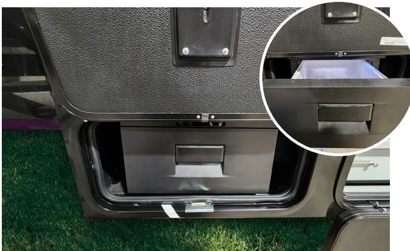

### **2. MORryde Cargo Tray**

Underneath the pass-through storage compartment, you will find sliding storage trays. MORryde Cargo Trays are designed to create easy access to your camping gear and tools, while maximizing your storage space.

To open the cargo tray, you must unlatch the locking mechanism found at each end of the tray.

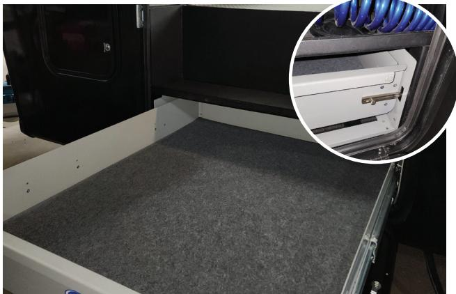

Prior to traveling with your RV, all stored items should be secured and trays must be placed back into the locked position.

### **3. Shore Cord Reel**

On the off door (driver) side of your RV, just behind the full pass-through compartment, there is a smaller compartment door. Once opened, you will see the below electric cord reel. This reel is intended to assist in storing your shore cord effectively and cleanly.

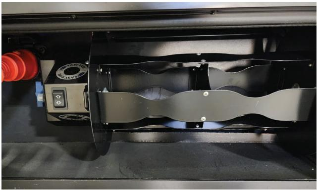

To operate this cord reel, make sure the shore cord is wrapped a minimum of one time around the reel to form tension. From there simply use the switch to wrap the reel.

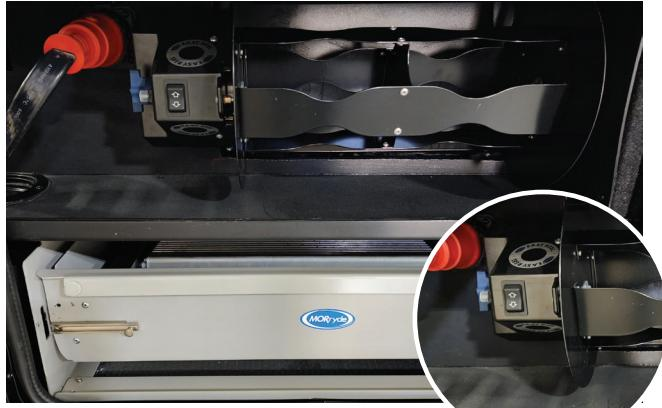

To release the shore cord,

use the switch and guide the cord out until the full length of cord is freed from the reel.

!!! warning
    **Do NOT utilize the 50 amp shore power cord while any portion of the cord remains wrapped around the cord reel. Utilizing the cord while it is coiled can result in overheating, melting the protective sheathing, or fire potentially resulting in damage to the cord, the RV, and could result in personal injury or death.**

### **4. Air Compressor**

On the off door (driver) side, near the rear of RV and just in front the fuel compartment, you will find an air compressor. This compressor is a one gallon (3.8 liter) air compressor capable of handling up to 135 psi (930.8 kPa). Below is a photo.

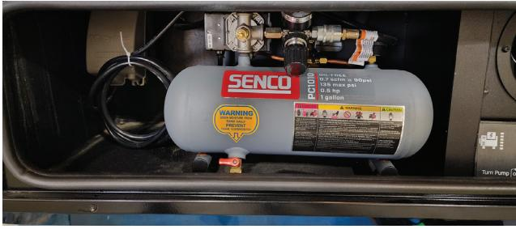

Please reference the manufacturer's manual for operating instructions and information.

### **5. Air Hose Reel**

For convenience and ease, a retractable air hose has been installed on your RV. It is located on the off door (driver) side of the RV towards the rear of the unit.

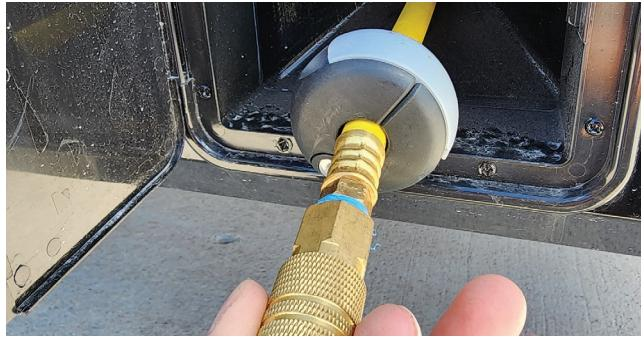

To operate, open the locked accessory door and carefully pull the hose out. To retract the hose, lightly pull to disengage the lock and allow the reel to retract.

### **6. Power Cord Reel**

For convenience and ease, a retractable power cord reel has been installed on your RV. It is located on the door (passenger) side of the RV towards the rear of the unit.

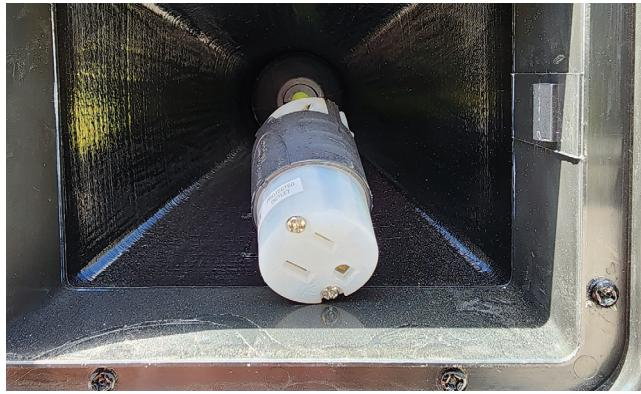

To operate, open the locked accessory door and carefully pull the extension out. To retract the extension, lightly pull to disengage the lock and allow the reel to retract.