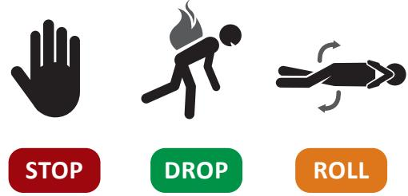
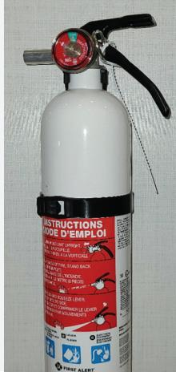
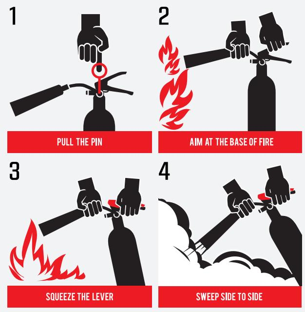
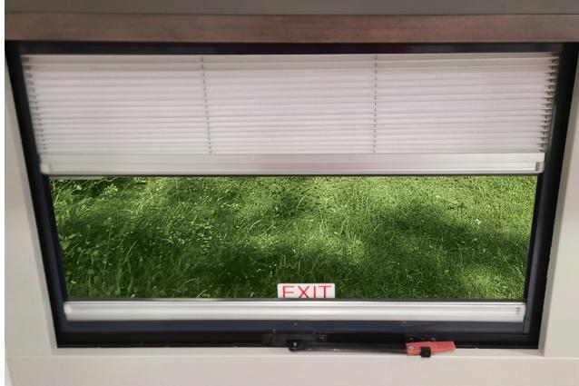
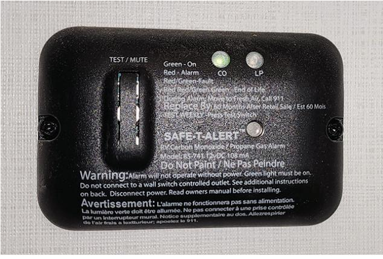
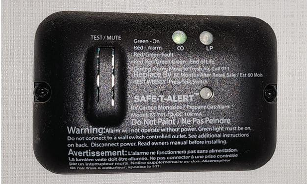
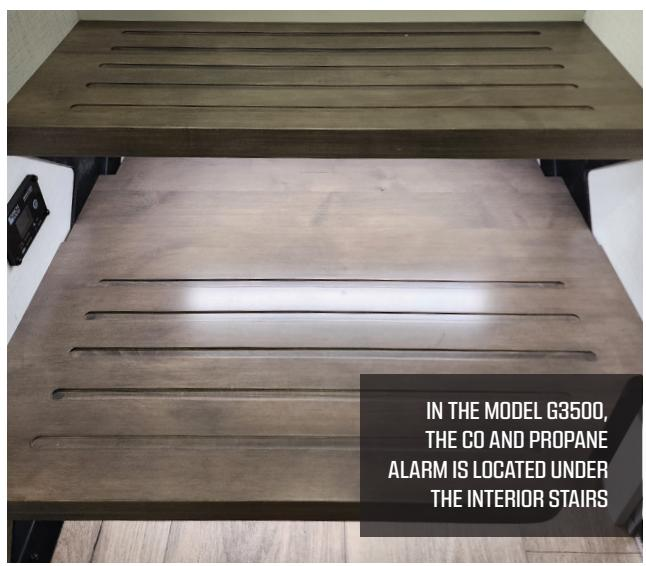

# SEC.04 **OCCUPANT SAFETY**

Your Brinkley RV is designed to include the features and functions we believe will help provide the ultimate Customer Experience. Rest assured that the safety of you, your family and your RV are of the utmost importance to us. Your Brinkley RV is designed to meet and/or exceed all safety codes and standards provided by RVIA, or Transport Canada if shipped to Canada, or otherwise required by law at the time it is manufactured.

It is our priority to ensure all safety items are properly and carefully installed to ensure the safety of all occupants within your RV. To further ensure the safety of you and others, please carefully and completely read and understand this Section.

## A. DEVELOP A FAMILY SAFETY PLAN

In case of emergency or severe weather, a Safety Plan should be developed in advance for you, your family, and any other occupants. Be proactive and practice your plan with your RV occupants, especially if children are involved.

- 1. Prior to using your RV, know where all doors, emergency exit windows, and safety equipment are located.
- 2. Know where the safety alarms are within your RV, and what it means if they are triggered. Educate everyone on how to properly evacuate the RV. If children are involved, please stress the importance of evacuating the RV with or without an adult in the event of an emergency.
- 3. Plan a minimum of two (2) ways to evacuate the RV. See also **Section 4D** pertaining to Egress Windows for additional information. The first form of exit can include the RV entry door, but the other planned route should not. It may be essential to practice blindfolded. In a real fire situation, smoke may make it difficult, if not impossible, to see.
- 4. In the case of a fire, make sure everyone knows how to check doors for heat and to leave the door closed if hot; stay low while moving; and avoid inhaling smoke, fumes, and/or gases as much as possible. Placing a cloth over your mouth and nose will assist in protecting you against inhalation of smoke, fumes, or gases.
- 5. Plan a meeting location near the RV but a safe distance away. Everyone should remain at this location until every occupant is accounted for.
- 6. Make sure everyone knows how to call 911 from outside the RV and where to go if they do not have a phone. A family emergency contact should also be established and memorized.
- 7. Safety drills should be discussed and practiced as needed every six (6) months or as frequent as necessary to ensure everyone's safety.

!!! warning
	**WHEN IN A FIRE RISK ZONE, ADHERE TO ALL FIRE AND SAFETY RESTRICTIONS THAT APPLY.**

!!! warning

	**BE CAUTIOUS OF THE HEAT INDEX WHEN CAMPING IN HIGH TEMPERATURE CLIMATES. KEEP HYDRATED AND STAY IN AIR CONDITIONED LOCATIONS DURING A HEAT INDEX WARNING.**

## B. EMERGENCY WEATHER PLANNING

#### **1. General Information**

It is very important to monitor weather conditions while camping. Weather is known to change with little to no warning and can put you, the RV, the tow vehicle, and all occupants at risk. Local weather stations broadcasted on TV and radio often provide updated weather conditions and warnings as they occur. Be sure to stay tuned as you are traveling and using your RV. Knowing how to deal with severe weather conditions is important to ensure you and your family's safety. If traveling to an area where weather is known to suddenly shift, a weather radio is recommended.

Weather radios broadcast 24-hour VHF weather observations and forecasts directly from the US National Weather Service (NWS). Frequencies used by the US National Oceanic and Atmospheric Administration (NOAA) weather radio are 162.400, 162.425, 162.450, 162.475, 162.500, 162.525, or 162.550 megahertz (MHz). You can also visit their website at **[www.noaa.gov](http://www.noaa.gov)**.

!!! warning
	**DURING SEVERE WEATHER CONDITIONS SEEK SHELTER INDOORS OR AS DIRECTED BY THE CAMPGROUND AND/OR APPROPRIATE LOCAL AUTHORITIES.**

!!! quote "Notice"
	Many emergency shelters do not permit the entry of pets due to health-related reasons and limited space. You as the owner are responsible to create a safety survival plan for your beloved pets. It is also recommended that the plan include a three (3) day supply of food and water for all occupants.

#### **2. Repairing Severe Weather Damage**

Please contact your insurance provider right away if your RV is damaged by severe weather. Contacting your insurance provider is required **PRIOR** to the repair(s) being scheduled and/or performed. Weather damage is covered exclusively by your insurance coverage and is not covered by Brinkley RV or its component manufacturers.

## C. FIRE SAFETY

#### **1. General Information**

The most common fire safety issues include, but are not limited to, smoking in bed, using flammable solvents and/or cleaning fluids, and leaving children unattended.

#### **2. Fire Emergencies**

#### **IN A FIRE EMERGENCY, EVACUATE THE RV FIRST, THEN CALL 911 FROM A SAFE LOCATION.**

- In a fire emergency, execute your Family Safety Plan as outlined in **Section 4A**.
- Ensure everyone knows to stop, drop, and roll if their clothes or hair catch on fire. The basic protocol for stop, drop and roll is as follows:
- **STOP** in place, do not run.
- **DROP** to the ground.
- **ROLL** back and forth, with your hands shielding your face from the flames.

#### **3. Common and Important Fire Safety Information**

Below is a list that includes common information related to fire safety. This list is not all inclusive of all rules related to fire safety. Common sense and attention to your surroundings may dictate additional guidance and protections that are required to prevent the spread of fire. Please use this list as a guide to ensure that fire safety is **ALWAYS** practiced by you, your family and other occupants of your Brinkley RV:

- **ALWAYS** supervise children around or near any open flames, especially grills, fire pits and campfires.
- **ALWAYS** learn and teach fire safety, prevention, and fire extinguishing practices.
- **ALWAYS** build campfires, place grills, or otherwise utilize open flames away from nearby trees or bushes and adhere to all federal, state and local laws related to fires and burning, including local burning bans and advisories. It is critical to always know and adhere to the restrictions in place for your location. Forest and field fires can be catastrophic to safety and property alike and can quickly spread.
- **ALWAYS** maintain at least a three (3) feet of clearance around grills, campfires, your RV, tents, and other structures or combustible materials. This three (3) foot zone should be free of leaves, dry grass, pine needles, or any other combustible substances to prevent the spread of fire.
- **ALWAYS** proactively have an action plan in place to rapidly and completely extinguish a campfire or other open flame.
- **ALWAYS** teach family members and RV occupants how to locate and properly use the fire extinguisher.
- **ALWAYS** replace your fire extinguisher as recommended by the manufacturer of the extinguisher.
- **ALWAYS** call the Fire Department, no matter how small the fire may seem.
- **ALWAYS** assume that, where there is smoke, there may be fire.
- **NEVER** store combustible materials in enclosed areas or near any heat source.
- **NEVER** leave a fire burning unattended. An ember or unextinguished cigarette can cause a fire to quickly spread out of control during dry conditions.
- **NEVER** use water to put out a grease or electrical fire. Utilizing water can spread grease fires and can create an electrocution or shock hazard during an electrical fire.
- **NEVER** assume that your family and other RV occupants are aware of and practice fire safety. It is your responsibility to ensure that everyone is prepared in the event of fire.

**Additional information pertaining to fire safety and firefighting can be located at the National Fire Protection Association (NFPA) website [www.nfpa.org.](http://www.nfpa.org)**

## + NOTICE

Notify Brinkley RV immediately if you feel that a product failure resulted in a fire. Please call Brinkley Customer Care at (574) 501-4280 or toll free (888) 502-3460 for approval before you re-enter the RV, have it moved or repaired, or any debris is removed or cleaned from the unit. A failure to notify Brinkley RV in advance could result in a loss of warranty coverage.

#### **4. Fire Extinguishers**

#### **a. General Information**

Fires can spread rapidly. Prior to reaching for the fire extinguisher, remember your Family Safety Plan. See **Section 4A** and remember that safety is the priority. Property can be replaced. People and pets cannot. If a fire starts in or around your RV, **SAFE EVACUATION OF ALL OCCUPANTS FROM THE RV IS THE FIRST AND UTMOST PRIORITY.**

 A dry chemical, Class B/ Class C type fire extinguisher is located near the entry door of your RV. The provided portable fire extinguisher should be utilized on small fires or to help contain larger ones until the fire department arrives on site. Portable extinguishers do have limitations and remember to always put your safety first.

#### **Household fire extinguishers are classified into four types by Underwriters Laboratories (UL):**

| RATING   | INTENDED USE                                                                                          |  |
|----------|-------------------------------------------------------------------------------------------------------|--|
| TYPE A   | FOR USE ON FIRES INVOLVING COMBUSTIBLE MATERIALS SUCH AS WOOD, CLOTH AND PAPER.                    |  |
| TYPE B   | FOR USE ON FLAMMABLE LIQUID FIRES, INCLUDING KITCHEN GREASE. NEVER USE WATER ON THIS TYPE OF FIRE. |  |
| TYPE C   | FOR USE ON FIRES INVOLVING ENERGIZED ELECTRICAL EQUIPMENT.                                         |  |
| TYPE ABC | WORKS ON ALL THREE TYPES OF FIRES LISTED ABOVE.                                                    |  |

#### **b. Operation**

When utilizing a fire extinguisher, it is vital to keep your back facing a clear and safe exit to maintain a safe escape route. Stop and evacuate immediately if the fire cannot be contained or if smoke fills the room.

#### **TO OPERATE A FIRE EXTINGUISHER, REMEMBER THE WORD: P.A.S.S.**

- **PULL** the pin. Hold the extinguisher with the nozzle pointing away from you and release the locking mechanism.
- **AIM** low. Point the extinguisher at the base of the fire.
- **SQUEEZE** the lever slowly and evenly.
- **SWEEP** the nozzle from side-to-side until the fire is out.

#### **c. Disposal**

For disposal of used fire extinguishers, contact your local fire, sanitation, or environmental protection department for rules and regulations applicable to their safe disposal.

## D. EMERGENCY EGRESS WINDOW(S)

## **1. General Information**

The entrance door is and should be your primary exit. In a situation where the entry door has been compromised, **the Emergency Egress Window (or exit window) should be your secondary exit route. All egress windows are clearly marked with an 'EXIT' label and have red handles for window operation.** See the picture below as an example. Some egress windows include the entire window. There are instances, however, where only a part or portion of the window is intended for egress. It is important to learn the proper use of all Emergency Egress Windows and practice how to operate them prior to an emergency occurring.

Please review and follow the additional information below:

- **ALWAYS** ensure the Egress Windows are not blocked by trees and/or any other obstacles when setting up your campsite.
- **ALWAYS** ensure that the ground around the outside of the RV at the egress window location(s) provides solid ground and an easy escape route.
- **ALWAYS** review proper escape routes in case of an emergency.
- **ALWAYS** locate all Egress Windows and review proper operation with all occupants within the RV.
- **ALWAYS** determine in advance the order of who will exit through the egress window and how it will be performed.
- Before exiting an Egress Window, if possible, place a blanket over the frame for protection.
- **ALWAYS** ensure that the last person to exit the RV, in the case of a fire, knows how to help others escape.
- **ALWAYS** ensure that all occupants of the RV know the predetermined meeting location if an emergency ensues.

#### **2. Maintenance**

To prevent the Egress Window seals from sticking, periodically open and close the windows. Before traveling, always make sure ALL windows are locked. It is important to ensure that all locks work properly and that Egress Windows operate properly prior to using the RV. Failing to lock windows prior to transit may result in wind damage to the windows.

# E. SMOKE ALARM

#### **1. General Information**

On the ceiling of your RV, you will notice a smoke alarm in the main living area. The smoke alarm is intended to alert you as soon as smoke is detected to reduce the risk of personal injury, property damage, or even death from smoke and/ or fire. Although smoke alarms are intended to provide you with enough notice and time to escape before a fire spreads, it is important to understand they are not foolproof. Smoke alarms will only be triggered when smoke reaches their sensors. Although a smoke alarm is a necessary safety alert system, common sense and your own

senses should be utilized to ensure the safety of you, your family, and any RV occupants at all times.

- It is crucial for smoke alarms to be properly located, installed, and maintained.
- Smoke alarms should not be tampered with and should be inspected on a continuous basis.
	- When the smoke alarm battery is supplying power, a red LED light will flash.
	- If the light is not flashing or if the alarm is chirping, the battery should be changed immediately.
	- A smoke alarm will not function correctly if the battery is missing, installed incorrectly, or is not the correct battery type.
	- If the battery is correctly replaced, and the alarm is still not functioning, replace the alarm.
- If smoke is detected by the alarm, it will trigger the audible alarm until the air is cleared.
- Those who have loss of hearing or specific medical conditions relating to hearing loss should consider using alarms that offer both audible and visual signals. Smoke detectors with visual alarms are **NOT** installed in your Brinkley RV from the factory.

#### **IF THE SMOKE ALARM SOUNDS:**

 When the alarm is triggered, a loud repeating alert or siren will sound and the light on the smoke alarm will rapidly flash red.

- The alarm signals that smoke has been detected and requires your immediate attention.
- Never ignore an alarm if it is triggered. Doing so may result in injury or death.
- When the alarm is triggered and it is evident there is a fire, evacuate the RV immediately.
- After you are a safe distance from the RV, call 911.
- Always refer to your Family Safety Plan and ensure all occupants know the plan.

!!! warning
	**Smoke alarms DO NOT function without a working battery. DO NOT disconnect the battery to silence the smoke alarm and ALWAYS make sure the alarm is working for continuous protection.**

!!! warning
	**Test all smoke alarms before every camping trip or use of your RV. This is especially important after your unit has been removed from storage and any time you have not utilized the RV for an extended period.**

!!! warning
	**Never use an open flame, such as a lighter or match, to test a smoke alarm. Doing so may result in setting fire to the smoke alarm and your RV. Always use the "Test" button on the alarm. If the smoke alarm does not signal right away, check the battery and replace the alarm as needed.**

#### **2. Testing a Smoke Alarm**

It is vital for smoke alarms to be tested on a weekly basis. When testing, stay an arm's length away from the alarm to make sure the alarm's signal does not injure or harm your hearing during the test.

#### **SMOKE ALARM TESTING PROCEDURE:**

- 1. **PRESS** and **HOLD** the **TEST/SILENCE** button found on the face of the alarm until the alarm sounds. The alarm may continue for a second or two after the **TEST/SILENCE** button is released.
- 2. If the alarm does not sound right away, check the power source (its battery) and then conduct the test again.
- 3. If the alarm still does not signal, **CHECK** and ensure the alarm is clean of dust and debris.
- 4. If the alarm still does not operate, it should be replaced immediately.

#### **3. Maintenance**

To keep the smoke alarm functioning properly:

- **NEVER** clean alarms with solvents, cleaning products, water, bleach, or any other substance that may damage the alarm.
- Carefully wipe with a clean rag or vacuum the smoke alarm at least once a month.
- **NEVER** paint the smoke alarm. Paint may clog or damage the opening of the sensing unit and prevent the alarm from functioning properly.

## F. CARBON MONOXIDE (CO)

#### **1. General Information**

Carbon monoxide (CO) is a colorless, odorless, tasteless, gas produced by the exhaust of burning fuel or the incomplete combustion of carbon. Sources of CO in or around your RV may be the exhaust from vehicles, generators, heaters, gas stoves and ovens, furnaces, portable grills, and/or any other gas-powered object or appliance.

CO can be poisonous even at low levels of concentration. With exposure to CO, victims tend to first experience nausea, dizziness, a dull headache, weakness, and confusion. In many situations, CO victims dismiss the early warning signs as just not feeling well and become disoriented to the point they are unable to escape or call for help. Signs and symptoms of CO poisoning will first be observed in young children and pets and should not be ignored. Immediate action is required.

THE CO AND PROPANE GAS ALARM. SEE SECTION 4G FOR ITS LOCATION IN THE RV.

# **CARBON MONOXIDE (CO) POISONING SIGNS AND SYMPTOMS:**

- **Mild exposure:** Dull headache, running nose, weakness, sore or watery eyes, and/or other flu-like symptoms.
- **Medium exposure:** Dizziness, drowsiness, and/or vomiting.
- **Extreme exposure:** Unconsciousness, brain damage, and/or death.

Discuss the signs and symptoms of CO poisoning with all family members.

!!! warning
	**Many carbon monoxide victims dismiss the early warning signs as just not feeling well and become too disoriented and are then unable to escape or call for help. NEVER avoid early warning signs. Doing so may result in brain damage or possibly death.**

!!! warning
	**If there are other vehicles or generators running nearby, there is a chance for exhaust fumes to enter into your RV. The best protection against carbon monoxide is proper ventilation and the use of a Carbon Monoxide Alarm. To maintain proper ventilation within your RV, make sure the vents on all ventilation systems are clear of snow, leaves, or any other possible debris.**

#### **2. Carbon Monoxide (CO) Alarm**

#### **a. General Information**

Carbon Monoxide Alarms will sound when the CO reaches a potentially dangerous level within your RV. Upon hearing this alarm, you should quickly evacuate your RV and remain clear of the unit until the RV is well ventilated and the alarm discontinues.

- It is crucial for CO alarms to be properly located, installed, and maintained.
- CO alarms should not be tampered with and should be inspected on a continuous basis.
- When the battery is supplying power, a red LED light will flash.
- If the light is not flashing or if the alarm begins chirping, the battery should be changed immediately.
- A CO alarm will not function correctly if the battery is missing, installed incorrectly, or is the wrong type.
- If the battery is correctly replaced, and the alarm is still not functioning, replace the alarm.

- If CO is detected by the alarm, it will trigger the audible alarm until the air is cleared. For those who may have loss of hearing or specific medical conditions relating to hearing loss, should consider using alarms that offer both audible and visual signals.
#### **IF THE CARBON MONOXIDE ALARM SOUNDS:**

#### **1. Ventilate the RV IMMEDIATELY.**

Open all possible doors and windows.

- a. **CHECK** that all occupants are accounted for.
- b. **CALL 911** for your local emergency service or fire department.
- c. **DO NOT** re-enter the RV and stay clear from its openings until the emergency responders arrive or until the CO alarm ceases due to proper ventilation and removal of the CO from the RV.
	- **2. Confirm that another motor vehicle or nearby RV is NOT the source of the CO.**
	- **3. If the CO alarm signals again within a 24-hour period:**
- a. **REPEAT** step 1 in its entirety.
- b. **BEFORE** continuing use of your RV, **CALL** a qualified appliance technician to inspect all appliances utilizing gas and their associated gas lines to investigate the sources of carbon monoxide entry.
- c. **IF PROBLEMS ARE IDENTIFIED** during the inspection process, service the equipment **IMMEDIATELY** and **DO NOT** continue use of your RV until repairs are completed.
- d. **NOTE** all combustion equipment not inspected and provide maintenance as needed per the supplier component manuals.

!!! warning
	
	**CO alarms DO NOT function without a working battery. DO NOT disconnect the battery to silence the CO alarm and ALWAYS make sure the alarm is working for continuous protection.**

#### **b. Testing the CO Alarm**

It is vital for CO alarms to be tested on a weekly basis. When testing, stay an arm's length away from the alarm to make sure the alarms signal does not injure or harm your hearing. Below are the testing instructions.

#### **TESTING THE CO ALARM:**

- Press and hold the **TEST/SILENCE** button found on the face of the alarm until the alarm flashes red. Once flashing, the alarm will then signal 4 times and repeat for 5-6 seconds.
- If the alarm does not signal in this manner, check the power source and then test again.
- If the alarm still does not signal, **CHECK** and ensure the alarm is clean of dust and debris.
- If the alarm still does not sound, replace the CO alarm immediately through your Dealer.

!!! warning
	**DO NOT remain within close proximity of alarm when sounding. Exposure within close range may be harmful to hearing. When testing, stay at arm's length away.**

!!! warning

	**Never test the CO alarm with vehicle exhaust or any other form of exhaust. This may lead to permanent damage and voids your warranty. This may also lead to personal harm.**

!!! warning

	**Test all CO alarms before every camping trip or use of your RV. This is especially important after your unit has been removed from storage. If the CO detector fails to test correctly, replace it immediately. Failure to do so may result in brain damage, injury, or death.**

!!! warning

	**The CO alarm sounding indicates potentially toxic levels of carbon monoxide which may result in brain damage or death. CO alarms will only indicate carbon monoxide is present at the sensor and does not indicate CO in other possible areas.**

!! quote "Notice"
	Replacing the CO alarm yourself can void the warranty. Be sure to use your Authorized Dealer while under warranty.

#### **c. CO Alarm Maintenance**

To keep the CO alarm functioning properly:

- **NEVER** clean alarms with solvents, cleaning products, water, bleach, or any other substance that may damage the alarm.
- **ALWAYS** carefully wipe the CO alarm with a clean rag or vacuum the smoke alarm at least once a month.
- **NEVER** paint the CO alarm. Paint may clog or damage the opening of the sensing unit and prevent the alarm from functioning properly.

## G. PROPANE GAS (LP) ALARM

#### **1. General Information**

Propane gas is used in many of the appliances within your RV. Examples include, but are not limited to, the furnace, water heater, ovens and cooktops, portable grills, etc. If a leak occurs, because propane is heavier than air, it will collect in lower areas. Because of this, a Propane Gas Detector is installed near the floor line of your wall in an open area.

- It is crucial for propane detectors to be properly positioned, CO and LP Gas Alarm installed, and maintained.
- Propane detectors should not be tampered with and should be inspected on a continuous basis.
- When the LED on the front of the detector is green, the alarm is active. If propane, acetone, alcohol, butane, and/or gasoline is detected by the detector, it will trigger the alarm until the air is cleared. Such chemicals can be found in deodorant, perfume, cologne, wine, adhesive, liquor, lacquer, kerosene, the propellants of aerosol cans, and most cleaning agents.
- Those who have loss in hearing or specific medical conditions relating to hearing loss should consider using alarms that offer both audible and visual signals. Alarms with visual alarms are **NOT** installed in your Brinkley RV from the factory.

#### **IF THE PROPANE GAS DETECTOR IS ALARMED:**

- 1. **Immediately EXTINGUISH all flames, smoking materials, and SHUT OFF all gas related appliances such as the stove, heater, furnace, refrigerator, etc. DO NOT** touch any electrical switch, use electronical devices or appliances, or cellular devices.
- 2. **EVACUATE** everyone from the RV immediately. Use your Family Safety Plan to safely evacuate everyone from the RV. See **Section 4A**.
- 3. **OPEN all door(s) and windows to ventilate the RV.**
- 4. **SHUT OFF all gas supply at the LP tank valve and any other provided source. DO NOT** start any vehicle engine, open flame, or generator near the RV.
- 5. **DETERMINE & REPAIR** the source of the leak.
- 6. **DO NOT RE-ENTER THE RV UNTIL THE PROBLEM IS CORRECTED.**

**PRIOR TO USING THE LP SYSTEM OR ANY LP RELATED APPLIANCE, CONTACT YOUR DEALER OR A PROPANE GAS EXPERT TO CORRECT THE PROBLEM.** 

## **DANGER**

**The sounding of this device means that there is a presence of LP gas, which may result in fire and/or an explosion. Leaks generally occur in LP gas piping and/or the LP gas appliances. Follow all information found within the supplier component manuals. Failure to do so may lead to carbon monoxide poisoning, fire, and/or an explosion causing property damage, personal injury, or death.**

!!! warning
	**High temperatures reactivate glues and adhesives within your RV and create a vapor. If a unit is closed on a hot day, the chemicals and vapors can collect creating a toxic level detectable by the Propane Gas detector.**

# H. INDOOR AIR QUALITY

- **1. Maintaining Indoor Air Quality**
- **ALWAYS** provide proper ventilation within your RV.
	- Proper ventilation carries pollutants and emissions out of your RV.
	- Poor ventilation will cause air pollutants to gather and potentially reach dangerous, toxic levels. Heat and humidity can cause this occurrence to accelerate.
- Clean the RV on a regular and frequent basis.
- Be proactive to protect against harmful air pollutants. These include but are not limited to: molds, pet dander, cleaning agents, pollen, and carbon monoxide from the use of charcoal, propane, or other fuel types.

!!! quote "Notice"
	Children, the elderly, and those with allergies, asthma, heart disease, and/or with chronic lung disease are at the greatest risk for reactions to poor air quality.

#### **2. Improving Indoor Air Quality**

- Open windows and doors so fresh air is available inside your RV.
- Spend time outside.

#### **CONTROL MOLD, ALLERGENS, AND OTHER SPORES:**

- Fix any water leaks immediately as they are found.
- Properly ventilate the RV.
- Clean on a regular basis removing dust, dander, pet fur, water, etc.
- Do not allow water or moisture to collect within the RV.
- Keep the windows closed and periodically run your air conditioner (A/C) and/or a dehumidifier (Customer Supplied).
- Clean any mold or mildew immediately that can be seen or smelled with proper solutions. We recommend one (1) cup (236.6 ml) bleach to one (1) gallon (3.785 liters) of water as a cleaning agent.

!!! quote "Notice"
	Never mix cleaning agents that can cause chemical reactions (ex: bleach and ammonia). Do not smoke within your RV or near an entry point into your RV. Do not use bug spray within your RV.

#### **3. EPA Recommendations**

The Environmental Protection Agency (EPA) provides and recommends three (3) basic strategies to improve indoor air quality within your RV:

• **Remove sources.** By eliminating sources of pollution and their possible emissions, you will effectively improve indoor air quality. This strategy is important and effective for the following pollutants:

#### - **Biological Contaminants:**

bacteria, molds, mildew, spores, viruses, dander, and pollen.

#### - **Household Products:**

Cleaning agents, disinfectants, cosmetic products, paints, and varnishes.

- **Pesticides or other chemicals**.
- **Ventilation.** Proper ventilation increases fresh airflow within the RV and lowers the concentration of pollutants present. Open doors, windows, and vents to allow fresh air to flow through your RV. Operating fans, air purifiers, and the RV air conditioner(s) or furnace also helps to bring in fresh air and force out stale, polluted air.
	- When the RV remains closed, airflow decreases increasing the presence of air pollutants.
	- Follow the recommendations within this manual to assist in avoiding exposure to air pollutants and outgassed chemicals.
- **Air Cleaners.** Air cleaners are designed to remove specified pollutants from the air. Their effectiveness depends on how well they are capable of collecting pollutants within their filters. An effective air cleaner requires an intake, proper filters, and a high air circulation return rate. Being that there are many types on the market, it is important to thoroughly research the product.

Many smaller, less expensive models are not as efficient with particle removal. Most common air cleaners DO NOT remove gaseous pollutants.

!!! quote "Notice"
	Chemical outgassing is a normal process that occurs and is not a defect within your RV. Please follow the recommendations within **Section 4H(4)**. Given that outgassing is normal and to be expected, it is not covered under any warranty provided.

#### **4. Chemical Sensitivity and Outgassing**

#### **a. General Information**

Upon purchasing a new RV, you may notice a chemical odor due to outgassing. More commonly, you will notice this after the RV has been closed up for a period of time. This is normal, and not a defect.

"Outgassing" is the release of gas or chemical vapor that was once trapped, frozen, dissolved, or absorbed within a material. This tends to occur in new RV's and will lessen over time as the materials acclimate and outgas.

Like a home, your RV is constructed using materials including, but not limited to linoleum, carpet, insulation, plywood, upholstery, and other common building materials. Being that these materials differ in chemical make-up from one another, it is to be expected they will outgas various chemicals, including formaldehyde. Increased temperatures and humidity will increase the outgassing process.

Being that RV's are much smaller than a home, the air exchange within an RV is greatly reduced. Minimal air exchange makes the smell of outgassed chemicals more exaggerated and noticeable.

!!! quote "Notice"
	If not properly ventilated, chemical sensitivity such as eye, nose, and throat irritation along with nausea, headache, or other asthma-like symptoms may occur. Children, the elderly, and/or those with a history of lung-related problems may be more susceptible to the effects of the outgassing process.

#### **b. Formaldehyde**

Formaldehyde is a naturally occurring substance that is used widely in building materials such as plywood, pressed wood, paneling, and medium density fiberboard (MDF), all of which are commonly used within the RV construction. Because formaldehyde is contained within some of the materials used within your RV and some people have sensitivity towards the chemical, it is important you properly ventilate your RV as instructed in **Section 4H**.

#### **c. California Air Resource Board (CARB) Notice**

Formaldehyde is used widely in building materials such as pressed wood products, particleboard, hardwood plywood paneling, medium density fiberboard (MDF), and plywood which are commonly used throughout the Recreational Vehicle Industry. As mandated by the RV Industry, Brinkley RV's contain composite wood products (hardwood plywood, particle board, and MDF) that comply with the California Air Resource Board (CARB) formaldehyde emission standards under California Code of Regulations § 93120.2(a) Phase 2 (P2).

!!! quote "Notice"
	Brinkley RV is compliant with the EPA Formaldehyde Standards for Composite Wood Products under Title IV of Toxic Substances Control Act and the California Air Resource Board (CARB) formaldehyde emission standards under California Code of Regulations § 93120.2(a). These can be found at **<https://www.epa.gov/formaldehyde/> formaldehyde-emission-standards-composite-wood-products** and **<https://ww3.arb.ca.gov/> research/indoor/formaldehyde.htm**.

## **5. Condensation and Moisture**

#### **a. General**

When staying in your RV for extended periods, condensation may occur within your RV if precautions are not properly taken. "Condensation" refers to when vapors found in humid air collects as water. Commonly, this will form in out-of-sight locations such as inside cabinets, closets, on ceiling panels, etc. Not only can condensation cause damage to your RV, it can also damage your personal belongings. When not properly controlled, condensation is often misconstrued as a water leak.

To minimize condensation within your RV, proper ventilation should be practiced. The use of a dehumidifier (Customer Supplied) is recommended if proper ventilation is not obtainable or if there is high humidity in the ambient air.

#### **b. Controlling Condensation**

To reduce moisture within your RV, please do the following:

- Ventilate the RV as often as possible.
- When bathing, showering, drying hair, etc. within the bathroom, keep the bathroom door closed and open the roof vent with the fan on.

The exhaust fan should be left on until all excess moisture exits the RV.

- When cooking, keep the microwave or range exhaust fan on (If Equipped). Cooking releases heat and moisture that may allow condensation to quickly build.
- **DO NOT** hang wet clothes inside your RV to dry.
- Keep a constant source of airflow within your RV to prevent condensation and mildew from forming. (i.e., fan, A/C, air purifier, dehumidifier).
- Keep temperatures cool and constant throughout the RV, including in cabinets, closets, and drawers.
	- While storing your RV, leave cabinets, closet doors and drawers partially open.
	- On an extended stay, periodically open closed off areas such as closets, cabinets, and drawers to allow ventilation.

!!! quote "Notice"
	Cabinets, closets, and drawers filled with stored goods and items will prevent circulation and may lead to condensation.

#### **c. Hot Weather Conditions**

When traveling in areas of high temperature, start the air conditioner (A/C) early in the day to help remove humidity while lowering the temperature in the RV. This will help prevent condensation and water accumulation leading to possible damage.

#### **d. Cold Weather**

- During cold weather, utilize your vents and exhaust fans on a continuous basis. This will help to lessen the amount of moisture in the air. Keeping your RV closed up during cold conditions will increase the amount of condensation build-up within your RV.
- Manage inside temperatures accordingly. As you increase the temperatures within your RV and as the temperatures outside fall, this temperature differential will cause condensation to accumulate in areas that are not insulated as well as others (i.e., windows, vents, wall studs, etc.).
#### **6. Where There Is Moisture, There May Be Mold**

#### **a. General**

"Molds" are microscopic organisms that can virtually live in any environment and under any condition. Mold requires a source of moisture (i.e., high humidity, wet/damp materials, standing water) to thrive and can grow in temperatures between 40° and 100° Fahrenheit (4.44° and 37.78° Celsius respectively).

According to the Center for Disease Control (CDC), exposure to damp and moldy environments may cause a variety of health-related concerns:

- For those sensitive to molds, exposure may result in coughing, wheezing, nasal congestion, and/or irritation of the eyes, throat, and/or skin.
- Those allergic to molds or who have compromised immune systems or lung-related conditions may have more severe reactions to exposure.

Mold can be harmful to many materials within your RV, especially natural wood products and fabrics. Please follow the tips below to help control moisture within your RV and the prevention of mold and mildew growth:

- When bathing, showering, drying hair, etc. within the bathroom, keep the bathroom door closed and open the roof vent with the fan on. The exhaust fan should be left on until all excess moisture exits the RV.

- When cooking, keep the microwave or range exhaust fan on (If Equipped). Cooking releases heat and moisture that may allow condensation to quickly build.
- **DO NOT** hang wet clothes inside your RV to dry;
- Keep a constant source of airflow inside your RV to prevent condensation and mildew from forming. (i.e., fan, A/C, air purifier, dehumidifier).
- Ventilate your RV as often as possible.

#### **b. Mold Prevention**

To help with the protection against mold within your RV, follow the below preventative measures:

- Regularly clean high traffic areas that have water present including the kitchen, bathroom, and convenience center (See **Section 21L** for information on the convenience center). On safe surfaces, mold and mildew cleaning agents are recommended.
- Clean and dry all standing water and spills immediately.
- Remove all damp items within your RV.
- Check sealants regularly. Reseal as needed to avoid water leaks.

## I. COLD WEATHER USE

When using your RV near freezing or below freezing temperatures, the following precautions MUST be taken:

- Water sources such as the freshwater and drainage systems require added protection against freezing.
- Sufficient power and propane are required to run your furnace to prevent possible freezing.
- Sufficient fuel for generator use (If Equipped), if camping in remote locations without shore power.
- Proper ventilation should be practiced helping reduce condensation. A dehumidifier (Customer Supplied) may be required if ventilation is not sustainable.
- Prior to operating slide-outs, compartment doors, locks, windows, vents etc., check for ice to avoid possible damage from occurring.

## + NOTICE

Brinkley RV's are not manufactured for sub-zero temperatures.

# J. WEBSITES OF INTEREST

We also recommend that you visit the following websites that maintain information about indoor air pollutants, including molds and formaldehyde, along with ways to improve indoor air quality:

- **[www.epa.gov/indoor-air-quality-iaq/](http://www.epa.gov/indoor-air-quality-iaq/) inside- story-guide-indoor-air-quality**.
- **[www.epa.gov/mold](http://www.epa.gov/mold)**.
- **[www.atsdr.cdc.gov](http://www.atsdr.cdc.gov)**.

# WEBSITE DISCLAIMER OF WARRANTY

Brinkley RV holds no liability whatsoever in connection with the services, information, and/or materials provided within the websites and/or external links noted in this manual.

This information is provided "AS IS" and is for informational purposes only. The use of this information provided is at your own risk. Brinkley RV is not liable for any possible errors,

inaccuracies, or omissions that may be present within the information regardless of the delivery of information, decisions made, or actions taken/not taken in reliance to the furnished external information.

Brinkley RV accepts no liability or responsibility whatsoever regarding the information provided on any external source linked or provided within this manual. This information is meant to be taken as general knowledge and not intended to address any specific situation for any given individual or entity.

Brinkley RV has no control over any external links provided and does not hold responsibility if the information is not fully comprehensive, accurate, complete, and/or up to date.

Brinkley RV has no liability for any loss and/or injury caused, in whole or part, by the actions, negligence, and or omissions of any contingencies beyond its control for compiling, delivering, or obtaining any information. This information is not to be considered professional nor shall it comprise legal advice.

# DISCLAIMER OF ENDORSEMENT

References that may be made within the external or third-party links such as specific commercial products, processes, or goods specific to trademark, manufacturer, or otherwise, shall not be taken as recommended, favored by, as or endorsement by Brinkley RV.

Brinkley RV does not exercise any form of editorial control over the information found within any provided external location. Brinkley RV is not responsible for the content within such external sites and does not warrant, guarantee, or endorse any referenced products, services, information, schools, or goods described or offered within these sources.

# K. ADDITIONAL SAFETY PRECAUTIONS

#### **1. Generators**

The generators built specifically for RV's should be the only type used within your Brinkley RV. It is important to only operate a generator (If Equipped or Customer Supplied) in an open, outdoor area to permit the exhaust to dissipate. When using a generator, be sure to close all windows, compartments, and entry doors to prevent carbon monoxide from entering your RV. Please refer to **Section 4F**, for carbon monoxide warnings and additional detail.

!!! quote "Notice"
	Generators are not intended to power sensitive electronics without using the appropriate protections such as a line conditioner and surge protectors. Sensitive electronics in need of protection include, but are not limited to, computers, TVs, printers, audio equipment, and video gear. Such electronics should only be operated on inverter-based generators or pure sine wave generators.

#### **2. Loading and Weight Distribution**

- **NEVER** surpass the RV's Cargo Carrying Capacity or Gross Vehicle Weight Rating.
- **ALWAYS** distribute the cargo weight evenly throughout the RV.
- **ALWAYS** position heavy items on the floor in the center (closest to the axles) of the RV.
- **ALWAYS** balance weights front-to-rear and side-to-side.

#### **3. Passenger Safety**

**NEVER** allow a passenger to ride inside your RV while in motion. This is against the law in many states and for safety reasons should be avoided.

#### **4. Propane Appliances and Equipment**

- **ALWAYS** turn **OFF** all propane and gas related appliances and equipment (including tanks) **PRIOR** to transporting your RV.
- **ALWAYS** know and understand all propane and gas related safety warnings and follow all manufacturer recommended operating procedures.

!!! warning
	**Fuel of any sort is highly flammable. Improper use may result in a fire or explosion leading to property damage, injury, and/or possible death.**

#### **5. Tire Pressure**

**ALWAYS** check tire pressures **PRIOR TO** transporting your RV, even for short distances. For proper tire inflation pressures, refer to the Tire Information Label. The Tire Information label is located on the driver side of the unit, in front of the LP compartment, and typically above the Federal ID (VIN) tag. See **Section 5C(4)**.

#### **6. Towing**

- **ALWAYS** follow posted speed limits but never exceed 65 miles per hour (104.6 km/h).
- **ALWAYS** respond appropriately to weather and/or road conditions that may impact stability, handling, and towing of your RV and tow vehicle.
- **ALWAYS** be aware of your surroundings.

#### **7. Wheel Torque**

- **ALWAYS** check the torque on all lug nuts **PRIOR TO** departing on any trip, including short distances. For lug nut torque specifications and patterns, refer to **Section 5J**.
- **ALWAYS** use a calibrated torque wrench to confirm torque.

!!! warning

	**RV's can sway and fishtail in high crosswinds or when exposed to external forces created by large vehicles as they pass. If caution is not exercised, control of the RV and tow vehicle can be lost resulting in serious damage, injury, and/ or death. Under such conditions, it is imperative to slow down and pay attention to other vehicles and your surroundings.**

# A. GENERAL

Traveling can be stressful. To reduce stress, we recommend using updated maps or GPS navigation to ensure your route utilizes the most up to date information. Call ahead to obtain tourist information in the areas you will be visiting. To ensure safety, make sure your designated camping area and planned adventures comply with all federal, state, and local rules and regulations.

- While away from your home, have someone you trust periodically check on your residence. If you plan to travel for more than two (2) weeks, consider contacting your local police in advance to keep surveillance of your home.
- Carry secondary keys for vehicles and your house on a separate key ring to prevent them from being lost.
- Ensure your driver's license is updated and valid. Renew your license in advance if it will expire during your travels.
- If you plan on visiting other countries, be sure to contact the border control nearest to your planned point of entry to obtain current entry rules and regulations (including rules for re-entering the United States).

# + NOTICE

Always carry your vehicle registration, insurance policy card(s), and warranty registration.

# B. TOW VEHICLE DISCLAIMER

Your tow vehicle's Towing Capacity **MUST BE GREATER** than the Gross Vehicle Weight Rating (GVWR) of your RV. If you do not know your Towing Capacity or if you are considering purchasing a new tow vehicle, contact your automotive manufacturer

or Dealer to obtain the towing specifications of the prospective vehicle(s). Be aware that some vehicles can be purchased with optional towing packages.

Some automotive manufacturers have brochures for their products that contain towing capabilities and specifications. This information should be reviewed to verify weight ratings and limitations. Make sure you are looking at your exact model, year, engine, transmission, etc., to ensure you are receiving accurate information.

# + NOTICE

Brinkley RV shall not be liable for any damages that may be incurred by the Customer, owner, or driver of a Brinkley RV as a result of the operation, use, and/or misuse of a tow vehicle.

# C. VEHICLE LABELS

Throughout your RV, labels and data plates are present containing information pertaining to safe operation, service instructions, RV specifications, and warnings. Be sure to read all provided labels, decals, and data plates before operating your RV. If any label within your RV is damaged, painted over, or removed, they should be replaced right away.

#### **1. Weight Ratings and Definitions**

It is vital to remain within the weight rating specifications of your RV and tow vehicle. Failure to do so may result in loss of warranty, damage to your tow vehicle, or damage to your RV. More critically, failure to adhere to weight limitations poses great danger to you and those around you when operating or towing your RV. Vehicle and RV weights fall into two categories:

- **Ratings** are maximum limit thresholds that should **NEVER** be exceeded. These limits are established by Brinkley RV and our component manufacturers in the design of the RV.
# SEC.05 **PRE-TRAVEL INFORMATION**

- **Weight** and **Load** are often used interchangeably and refer to the actual weight of the RV. Weight or Load is measured by placing an RV, tow vehicle, or its components on a scale. Vehicles and added cargo add weight and affect the distribution of weight to the hitch, tires, and axles.
!!! warning

**Exceeding a rating may result in unsafe conditions, potential damage, may void warranty, may complicate an insurance claim, and in some cases, may violate applicable law.**

!!! warning

**The volume of space available for storage may exceed the amount of available Cargo Capacity. Large storage compartments have been designed to accommodate normal camping items, which are bulky, but not necessarily heavy.**

!!! warning

**The actual total weight of the RV, its options, holding tanks and contents, personal cargo, and hitch weight are important to know so that you DO NOT exceed the Gross Vehicle Weight Rating (GVWR) of the RV.**

To better understand how to safely manage your RV's weight and balance, please see the weight-related definitions outlined below:

#### **Gross Axle Weight Rating (GAWR)**

Gross Axle Weight Rating (GAWR) is the maximum weight the axles are designed to carry.

#### **Gross Vehicle Weight Rating (GVWR)**

Gross Vehicle Weight Rating (GVWR) (also known as Maximum Load Capacity) equals the GAWR plus the hitch weight. GVWR is the maximum allowed weight your trailer is rated to carry. This weight includes the weight of the trailer itself and ANY cargo or equipment you intend to haul inside the RV.

#### **Gross Vehicle/Trailer Weight (GVW or GW)**

Gross Vehicle Weight (GVW) is the actual weight of the RV, including everything in or on the RV, and is established by measuring on a scale. This is the actual weight of the trailer fully loaded.

#### **Gross Combined Weight Rating (GCWR)**

The Gross Combined Weight Rating (GCWR) is the maximum allowable weight of a fully loaded tow vehicle and the weight of the fully loaded RV combined.

#### **Gross Combined Weight (GCW)**

Gross Combined Weight (GCW) is the actual weight of your fully loaded RV and tow vehicle combined, as measured on a scale.

#### **Unloaded Vehicle Weight (UVW) (or Dry Weight)**

Unloaded Vehicle Weight (UVW) or Dry Weight is the weight of the RV as it is built from the factory with no added water, fuel, propane, supplies, or passengers. This includes only the items installed at the factory and no aftermarket installations made by you, the Dealer, or any other entity.

#### **Hitch Weight (HW) (or Tongue Weight)**

Hitch Weight (HW) or Tongue Weight is the actual amount of weight that presses down on the hitch when the RV is connected to the towing vehicle.

#### **Cargo Carrying Capacity (CCC)**

Cargo Carrying Capacity (CCC) is the maximum weight of personal cargo that can be added to the RV.

- **In the United States:** CCC = GVWR [UVW and LP gas weight]. Water is a component of the CCC.
- **In Canada:** CCC = GVWR [UVW, LP gas weight, and full fresh (or potable) water weight (including the water heater)]. Water weight is not a component of the CCC.

#### **2. Weight Labels**

Vehicle weight labels are placed on every RV to ensure the owner and/or potential buyer is fully aware of this information. Proper weights and limitations are important to the use of your RV.

## + NOTICE

Do not remove these labels. If the labels are missing or damaged contact your Dealer or Brinkley RV Customer Care for replacement decals.

#### **3. Federal Certification Label**

The Federal Certification Label specifies the maximum capacities for GVWR, GAWR, and the tires. This is located on the driver's side (also known as the off door side) towards the front of your RV. Typically, this label is located in front of the LP compartment.

Below is an example of the Federal Certification Label. Note that the information on your specific RV on this tag will vary from what is shown below:

| MANUFACTURED BY/FABRIQUE PAR: Brinkley RV                                                                                                                                                                                                                                                                                                                                                                                                                                      | · DATE: 10/2022 |
|--------------------------------------------------------------------------------------------------------------------------------------------------------------------------------------------------------------------------------------------------------------------------------------------------------------------------------------------------------------------------------------------------------------------------------------------------------------------------------|-----------------|
| GVWR / PNBV 6348 KG (13995 LB)                                                                                                                                                                                                                                                                                                                                                                                                                                                 |                 |
| GAWR (EACH AXLE) / PNBE (CHAQUE ESSIEU) 3175 KG (7000 LB)                                                                                                                                                                                                                                                                                                                                                                                                                      |                 |
| UVW 5330 KG (11750 LB)                                                                                                                                                                                                                                                                                                                                                                                                                                                         |                 |
| TIRE/PNEU ST215/75R17.5 RIMJANTE 17.5                                                                                                                                                                                                                                                                                                                                                                                                                                          |                 |
| COLD INFL. PRESSIPRESS. DE GONFL. A FROID 221 KPA (125 PSI/LPC) SINGLE                                                                                                                                                                                                                                                                                                                                                                                                         |                 |
| THIS VEHICLE CONFORNS TO ALL APPLICALLE U.S. FEDERAL MOTOR VEHICLE SAFETY STANDARDS IN EFECT ON THE DATE OF MANFACTURE SHOWN ABOVE THIS VEHICLE CONFORMS TO AL APPLICABLE STANDARDS PRESCRED UNDER THE CANADANI MOTOR VEHICLE SAFETY REGULATIONS IN EFFECT ON THE ONTE OF THE MANUFACTURE. - CE VEHICLE ES NORMES QUI LU SONT APPLICABLES ENVERTUDURES ENVERTUDU REGERIENT SUR LA SECURITE DES VEHICULES AUTOMOBILES DU CANADA EN VIGUEUR A LA DATE DE SA FABRICATION |                 |
| V.I.N.N.I.V :: 7TOFZ3620PT000002 TYPE/TYPE: TRAILER TRAILER TRAVREM: Fifth Wheel                                                                                                                                                                                                                                                                                                                                                                                               |                 |
|                                                                                                                                                                                                                                                                                                                                                                                                                                                                                |                 |

#### **4. Tire and Loading Information Label**

The Tire and Loading Information Label provides tire size information, recommended tire pressure(s), and the maximum amount of cargo that can be safely added to the RV. This label is located on the driver's side (also known as the off door side) towards the front of your RV.

Typically, this label is located in front of the LP compartment. Below is an example of what the Tire and Loading Information looks like. The information contained on this tag may vary on your RV from what is shown below.

| TRE PNEU         | STE DIMENSIONS | COLD TIRE PRESSURE PRESSION DES PNEUS A FROID | SEE OWNER'S MANUAL FOR ADDITIONAl |
|---------------------|-------------------|-----------------------------------------------------|-----------------------------------------|
| FRONT AVANT      | ST215/75R17.5     | 862 KPA / 125 PSI                                   | INFORMATION                             |
| REAR ARRIERE     | ST215/75R17.5     | 862 KPA / 125 PSI                                   | VOIR LE MANUEL DE L'ISAGER           |
| SPARE DE SECOURS | ST215/75R17.5     | 862 KPA / 125 PSI                                   | POLIR PLUS DF RENSEIGNEMENTS         |

#### **5. Cargo Carrying Capacity (CCC) Label**

The Cargo Carrying Capacity Label specifies the maximum cargo carrying capacity for your RV. It is located on the outside of your RV on the edge of the main entry door.

An example label is provided below:

#### **6. RV Length**

#### **a. Travel Trailers**

The length of the RV is measured from the tip of the hitch coupler to the end of the rear most extremity of the RV.

#### **b. Fifth Wheel Trailers**

The length of the RV is measured from the most extreme front profile, commonly the tip of the pin box, to the end of the rear most extremity of the RV.

#### **c. RV Overall Length Exclusions**

The overall length of your RV excludes select accessories as defined by Brinkley RV, including but not limited to the following:

- Safety-related equipment such as signals, clearing, indication, and warning lights.
- Appliance vent and vent hoods.
- Door latches and hinges.
- Entry and exit handles, grab bars, and/or railings.
- Exterior installed ladders.
- Spare tires, tire brackets, and/or carriers.
- Rear bumper.
- Outdoor cooking appliances.
- Towing hitch or cargo accessory receivers.
- Equipment or racks utilized to secure cargo.

# D. CARGO CAPACITIES AND WEIGHTS

When loading your RV with cargo, **DO NOT** exceed any of the following:

- The maximum Cargo Carrying Capacity (CCC) noted on the Federal Tag.
- The Gross Vehicle Weight Rating (GVWR).
- The Maximum Load Rating of your RV tires.

# **WARNING**

**The load capacity of your RV is designated by weight, not by volume. All available storage space cannot necessarily be used when loading the RV. For the best possible handling:** 

- **DO NOT exceed your GVWR.**
- **Ensure you are loading the vehicle evenly.**
- **Secure all loose or heavy items to prevent shifting during travel.**

#### **1. Maximum Load Rating**

The Maximum Load Rating of your RV tires may be less than the GVWR. To calculate the load on your RV tires, subtract the hitch weight from the RV's Gross Weight or Total Weight. The hitch weight is carried by your tow vehicle, NOT the RV tires. Therefore, the hitch weight is subtracted.

#### **EXAMPLE CALCULATION:**

- Each RV tire is rated at 4,800 lbs. (2,177 kg), and there are 4 tires. 4 tires x 4,800 lbs. = 19,200 lbs. (8,709 kg)
- The Gross Vehicle Weight of the RV is 15,000 lbs. (6804 kg) with a hitch weight of 1,300 lbs. (590 kg): 15,000 lbs. (6804 kg) – 1,300 lbs. (590 kg) = 13,700 lbs. (6,214 kg) to be carried by the tires.
- In this example, the load distributed on the RV tires is 13,700 lbs. (6,214 kg) This is below the 19,200 lb. (8,709 kg) maximum tire load rating in the example.
- This figure should **ALWAYS** be under the maximum load rating of the tires. If it is not, you must remove weight from the RV to reduce the load on the tires below the maximum tire load rating.

#### **2. Water and Propane (US ONLY)**

- Fresh water is to be calculated as part of the Cargo Carrying Capacity Weight.
	- Water weighs approximately 8.3 lbs. per gallon (1.0 kg per liter).
	- Based on this weight per gallon, a 50-gallon (189.3 liters) tank full of water will weigh roughly 417 lbs. (189.2 kg).

When nearing GVWR, try reducing the amount of water in the holding tank to lessen the water weight and to increase the amount of weight available for additional cargo needs. This will provide additional flexibility when making choices to match your travel and camping needs without compromising safety.

#### **ALWAYS REMEMBER:**

- **The Unloaded Vehicle Weight (UVW) is calculated with empty LP bottles, holding tanks, and as built at the factory. Modifications are not included in the calculation.**
- **In the United States, Cargo Carrying Capacity is calculated including the weight of full LP bottles. CCC = GVWR - (UVW + LP gas weight). Water is considered part of the cargo weight.**
- **In Canada, Cargo Carrying Capacity is calculated including the weight of full LP bottles and full freshwater tanks, including the water heater. CCC = GVWR – [UVW + LP gas Weight + full fresh/potable water tanks (including the water heater)].**

For further questions, please contact your Dealer or Brinkley RV Customer Care.

#### **3. Loading Your RV**

When loading your trailer, it is critical that you understand the weight limitations of your RV and tow vehicle as well as the importance of maintaining a balanced load from side-to-side of the RV. **Section 5D(4)** below covers the weighing process in detail to help ensure that you properly load your RV prior to travel.

!!! warning

**ONLY store items in the areas designated for storage. DO NOT store anything in the areas reserved for the furnace, water heater, converter, electrical panels, and other appliances.**

!!! warning

**During a sudden stop, free-standing furniture or overlooked items on the counter tops or shelves can become dangerous projectiles. It is important to secure the appliance or furniture with tie-down straps (If Equipped or Customer Supplied). Be sure to store and secure all loose items inside your RV. Check that all items are safely put away BEFORE travel.**

#### **4. Weighing the Tow Vehicle and RV**

#### **a. In General**

**Total weight** and **balance** of the RV are the two most important factors when loading your RV. It is important to **ALWAYS** follow and never exceed the weight rating limits specified for your RV. To ensure you are not exceeding your Gross Vehicle Weight Rating (GVWR) and other weight limitations, you should weigh your RV at a public scale or weigh station once your RV is fully loaded.