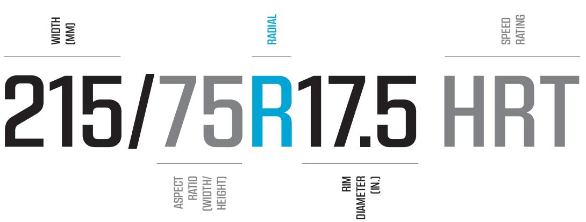
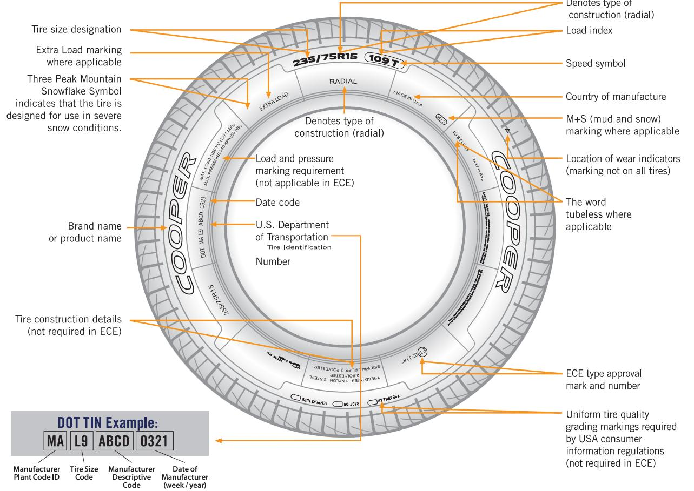
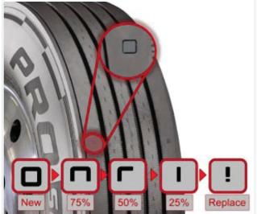
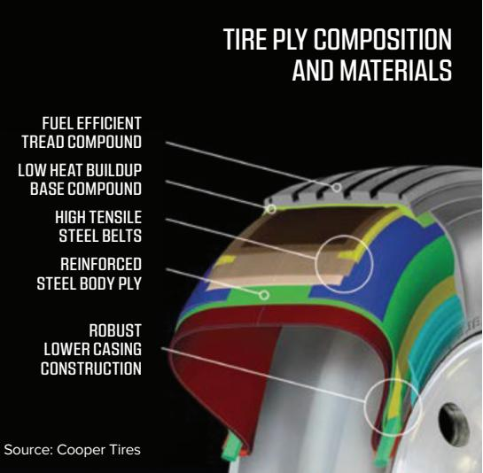
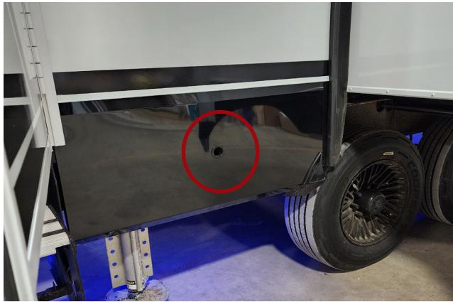
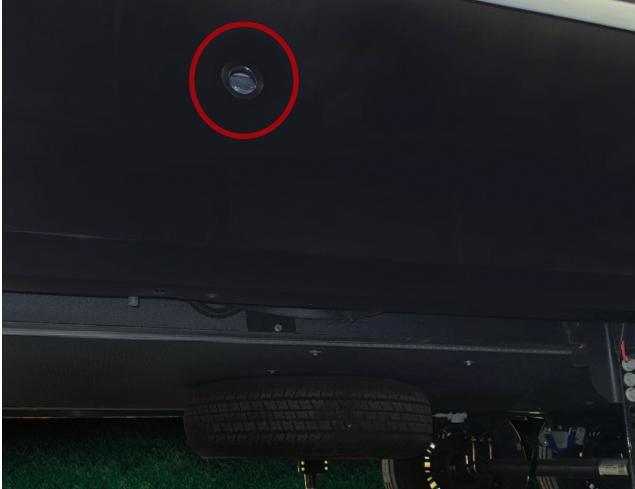
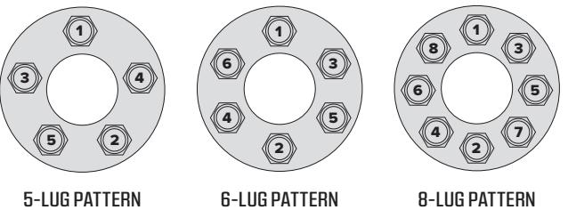
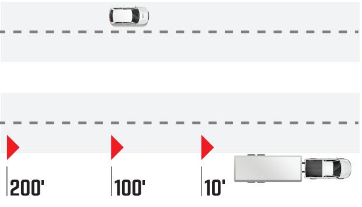

# SEC.05 **PRE-TRAVEL INFORMATION**

Utilizing a scale will also help to determine proper load distribution. To better ensure you are balancing load within your RV, it is best to use a weigh station that has separate scales to weigh the driver and passenger sides of the RV.

## + NOTICE

Individual scales and weigh stations may operate differently. If you have any questions or concerns, do not hesitate to contact us. It is our priority to ensure you have the tools necessary to safely tow your RV.

#### **b. Weighing Your Tow Vehicle and RV**

It is important to read and understand the weighing instructions prior to attempting to weigh your RV. Understanding this information is vital to ensure your safety. When weighing your RV, it must be weighed fully loaded with all contents you intend to travel with (i.e., food, water, clothing, supplies, propane, fuel, etc.) to obtain an accurate measurement and to determine whether you are within the weight limitations provided.

## **WARNING**

**An RV that is overloaded or has an imbalanced load will adversely affect your tow vehicle's handling and braking capabilities. It can also lead to component failures that could leave you stranded on the side of the road. Overloading can affect your safety and the safety of those around you. It will also lead to voiding of any applicable warranties as overloading is considered a form of misuse.**

# **WARNING**

**DO NOT EXCEED YOUR GVWR!**

**You should weigh the RV as loaded for your normal travel to determine the actual weight. If you exceed the GVWR, you MUST remove items from the RV, or drain liquids, then reweigh the RV to ensure you have achieved a safe weight below the stated GVWR. Also, DO NOT travel with full gray/black holding tanks as doing so negatively impacts fuel efficiencies and the towing and handling characteristics. It is also recommended that you NOT travel with a full fresh tank. You should plan to fill the fresh tank as close to your end destination as possible.**

## **WARNING**

**NEVER load the RV more than the GAWR for either axle. Overloading the RV may result in adverse handling characteristics and damage to the RV chassis. Evenly distribute your cargo side-to-side for safe travel. The weight on each tire must not exceed one-half of the GAWR (Gross Axle Weight Rating) for either axle.**

## **WARNING**

**Exceeding the established weight ratings for the axles, running gear, tires and wheels can lead to failure that can affect motor vehicle safety and lead to property damage or damage to the RV.**

#### **PROPER WEIGHING PROCEDURE:**

#### **1. GROSS VEHICLE WEIGHT CALCULATION**

#### **Weigh your RV while unhitched**

**from the tow vehicle** to obtain your Gross Vehicle Weight (GVW). Be sure to pull the tow vehicle far enough away such that it is not included in the weight calculation. You will also have to lower the landing gear (fifth wheel) or tongue jack (travel trailer) to obtain the weight measurement.

- a. For safe operation, your Brinkley RV's Gross Vehicle Weight (GVW) **MUST** be less than or equal to the Gross Vehicle Weight Rating (GVWR).
- b. If your Brinkley RV's GVW is greater than the GVWR, you **MUST** remove contents until the GVW is less than your Brinkley RV's listed weight ratings.

#### **2. GROSS COMBINED WEIGHT CALCULATION**

#### **Hitch your RV to the tow vehicle**.

Weigh the RV and tow vehicle to obtain your Gross Combined Weight (GCW).

- a. Confirm that your **GCW is less than, or equal to the GCWR** specified by the manufacturer of your tow vehicle.
- b. If your **GCW is greater than the GCWR**, remove contents until the weight is less than the GCWR.

#### **3. HITCH WEIGHT CALCULATION**

#### **While still hitched to the tow vehicle,**

pull onto the scale to weigh only the RV, and record that weight. This measures the total load carried by the RV tires. This weight, when subtracted from the GVW, is your Hitch Weight.

#### **4. BALANCED WEIGHT CALCULATIONS**

#### **To obtain the side-to-side weights of the RV,**

there must be ample room on either side of the scale to accommodate the RV being partially off the scale.

- a. Pull the RV so that the tires of only one side of the RV are on the scale. our RV must remain as level as possible in order to obtain an accurate weight measurement.
- b. **For a balanced load:** The weight of one side of your RV, must be equal to one half (1/2) of the total weight on the tires that you measured in step 3 above. If this is not the case, then you must redistribute the load until the RV is equally balanced side-to-side.

If you have questions or concerns, please consult with your Dealer, scale operator, or Brinkley Customer Care for additional assistance.

## **WARNING**

**The total weight of your tow vehicle and RV must not exceed the GCWR. NEVER assume that you can tow an RV that happens to be within the capacity of the tow vehicle hitch. By doing so, you may exceed the total GCWR.**

## **WARNING**

**It is important to redistribute the load to avoid component failure as well as to improve the handling characteristics of the vehicle. When a load is unbalanced, the components located on the heavier side of the RV (the wheels, brakes, springs, axle hangers, tires, etc.) may be overloaded, even though the total axle load is within the limits imposed by the GAWR.**

# SEC.05 **PRE-TRAVEL INFORMATION**

# E. TIRE SAFETY INFORMATION

#### **1. Introduction**

This section of the Owner's Manual contains tire safety information as required by 49 CFR 575.6(4) and is based in part on the National Highway Traffic Safety Administration's (NHTSA) brochure entitled "Tire Safety, Everything Rides On It." This brochure is available as a free download on the NHTSA website: **<https://one.nhtsa.gov/Vehicle-Safety/Tires/> Tire-Safety:-Everything-Rides-On-It**.

**Tire safety studies show that the most important things you can do to avoid tire failure, blowouts and flat tires are as follows:**

- **ALWAYS** maintain proper tire pressures.
- **OBSERVE** and adhere to tire and vehicle Load Limits. **NEVER** carry more weight in your vehicle than your tires or vehicle can safely handle.
- **AVOID** road hazards.
- **DRIVE** within the designated tire speed ratings.
- **INSPECT** tires for slashes, cuts, marks, and other irregularities.

#### **These actions, along with other care and maintenance activities, can also:**

- Improve vehicle handling.
- Improve stopping distance.
- Increase traction.
- Improve overall fuel economy.
- Help protect you and others from avoidable and/or preventable breakdowns and accidents.
- Increase the life of your tires.

Make tire safety a regular part of your vehicle maintenance routine. Know that the time you spend on tire safety and maintenance is minimal compared to the inconvenience and safety consequences of a flat tire or other tire failure.

#### **2. Maximum Load Rating**

The Maximum Load Rating indicates the maximum load in pounds (or kilograms) that can be safely carried by the tire.

#### **3. Maximum Inflation Pressure**

The Maximum Permissible Inflation Pressure is the greatest amount of air pressure that the tire should ever be inflated to under normal driving conditions.

## **4. Recommended Tire Pressure and Load Limits**

## **WARNING**

**Under-inflated tires and overloaded vehicles are major causes of tire failure.** 

Tire information placards and vehicle certification labels provide important information regarding tires, weights, and load limits, including the following:

- The recommended tire size.
- The recommended tire inflation pressure.
- The Cargo Carrying Capacity (CCC).
- The front and rear Gross Axle Weight Ratings (GAWR).

For definitions and information regarding labels See **Section 5C**.

#### **5. Understanding Tire Pressure and Load Limits**

**Load Limits** are determined by the tire size and the maximum amount of weight each tire can safely carry.

**Tire Pressure** is the amount of air pressure a tire requires to achieve proper inflation. It is measured in pounds per square inch (psi) or kilopascals (kPa). Tire pressure affects your RV's overall performance and provides the load-carrying capacity.

On the Tire and Loading Information Label, the proper tire pressure for your vehicle is listed as Cold Tire Pressure. You will find this number expressed in both psi and kPa.

## **WARNING**

**Always check tire pressure when tires are cold. Cold tire inflation pressure is defined as a tire that has not been used for three (3) or more hours or has been driven less than one mile (1.6 Kilometers) prior to the pressure measurement. Note that a hot tire may increase the tire inflation pressure by as much as six (6) psi (41.4 kPa) over a cold tire. DO NOT exceed the maximum recommended pressure.**

## + NOTICE

The axle and wheel assemblies on your RV are designed and manufactured much differently than that of an automobile. The overall size, weight, and balance of your RV exposes the wheels to pressures that are unique to trailering. When turning, or cornering, the wheels and tires experience a considerable amount of stress known as "side loading."

#### **6. Checking Tire Pressure**

#### **a. Frequency**

It is important to check the cold inflation pressure of your RV's tires at least monthly since:

- Most tires will lose air pressure naturally over time, particularly when the outdoor temperatures fluctuate.
- Tires can suddenly lose air after driving over a pothole, hitting road debris, or striking a curb.
- With radial tires, it is generally not possible to visually determine if a tire is under-inflated.

## + NOTICE

For safety and convenience, you should always keep a Tire Pressure Gauge in your vehicle.

#### **b. Maintaining Proper Tire Pressure**

#### **TIRE PRESSURE:**

- 1. The recommended cold inflation pressure is listed on the Tire and Loading Information label located on the exterior of your RV, on the off door side, forward of the LP compartment. You should first locate this label to ensure that you know the recommended cold inflation pressure of each tire.
- 2. Use a Tire Pressure Gauge (Customer Supplied), to check the tire pressure of every tire:
- a. If the tire pressure is above the maximum inflation pressure in any of the tires, gently press on the tire valve stem release valve with the edge of your tire gauge. Slowly release air until the correct pressure is obtained.
- b. If the tire pressure is below the recommended cold inflation pressure in any of the tires, immediately add air to any underinflated tires.
	- 3. At a service station or otherwise utilizing an air compressor, add air to each under- inflated tire until the correct cold inflation pressure is reached. **DO NOT OVER-INFLATE**.
	- 4. Re-check the RV tires with the Tire Pressure Gauge. Confirm that all tires are at the same recommended cold inflation pressure. Make any additional adjustments as needed.

# SEC.05 **PRE-TRAVEL INFORMATION**

## **WARNING**

**If the total weight of the RV (GVW) exceeds the GVWR, the RV is overloaded. Operating your RV while exceeding the specified weight ratings increases the risk of a crash, personal injury and death. It is imperative that you remove cargo (equipment, water, personal belongings, etc.) until the total weight of the RV no longer exceeds the GVWR before operating the RV.**

## **WARNING**

**Although it is ideal to check and fill tire pressures when the tires are cold, if you discover a tire on your RV that is underinflated, even if the tires are warm, add air until the recommended cold inflation pressure is reached. The warm tire may remain slightly underinflated, but this is much safer than driving with a significantly underinflated tire. REMEMBER to recheck and adjust the tire pressure(s) as soon as a cold tire pressure reading can be obtained to ensure proper inflation.**

#### **7. The Effect of Overloading Your RV and Tires**

Overloading your RV and/or tow vehicle's suspension system can cause spring, axle, shock, chassis damage and/or brake failures. Overloading your RV can increase stopping distances, create handling and/or steering problems or difficulties, cause irregular tire wear, blow-outs, tire failure, and/or other damage to the RV and/or tow vehicle.

And, in cases of excessive overloading, RV brakes are at risk of failing completely, particularly on steep declines when the weight of the RV applies additional stress to the brake system.

Tire overloading caused by exceeding Cargo Carrying Capacity and/or improper inflation of tires may result in abnormal flexing, wear, and tear of the tire. Abnormal tire flexing can cause an excessive amount of heat to generate within the tire. This should be avoided at all costs. Failure to do so may result in fire and/or damage to tire assembly and/or RV.

## **DANGER**

**EXCESSIVE HEAT MAY LEAD TO TIRE FAILURE. PROPER INFLATION IS CRITICAL. It is the air pressure that enables a tire to support the load.**

## **DANGER**

**Overloading your RV can have serious consequences for passenger safety. An overloaded vehicle is generally harder to drive and more difficult to stop. Excessive overloading may also cause brakes to fail completely.**

## **DANGER**

**If the weight on the trailer axles exceeds the GAWR, the axles are overloaded. Operating your RV while exceeding the specified weight ratings increases the risk of a crash, personal injury, and death. It is imperative that you remove or rearrange cargo (equipment, personal belongings, water, etc.) until the axle weight no longer exceeds the GAWR before operating the unit. Not operating your RV within the designed weight ratings can damage your RV and can void the warranties.**

#### **8. Proper Tire Load Limits**

Tire size, load range, and corresponding inflation pressure all determine the load a tire can safely carry. The required air pressure for RV tires must be determined by the actual load of the RV and taken from the Load and Inflation Tables provided on the tire manufacturer's website (See **Section 5D(4)** for weighing instructions).

- The air pressures recommended on tire manufacturing websites may differ from those provided on the certification label of your RV.
- RV weight and/or tire pressure should never exceed the tire's stated Maximum Load Rating or maximum air pressure.
- If you discover that your tires cannot support your RV's weight, REMOVE enough cargo until the RV's weight is within the stated limits.

#### **To determine the correct cargo load limit:**

- Locate the statement "The weight of cargo should **never exceed** XXX KG or XXX LBS" on your RV's Cargo Carrying Capacity label. See **Section 5C(5)** for information on the CCC label.
- The Cargo Carrying Capacity is the available load capacity for cargo and luggage (See **Section 5** above for full details and definitions). The combined weight of cargo and luggage loaded on your RV must not exceed the Cargo Carrying Capacity.

#### **9. Tire Safety Tips**

#### **Preventing tire damage**

- **DO NOT** run over curbs, potholes or foreign objects in roadways, campsites, or when parking.
- **SLOW WAY DOWN** if you cannot avoid a pothole, animal, or any other object in the road.

#### **TIRE SAFETY CHECKLIST:**

- 1. **CHECK** all tire pressures prior to every trip, including any spare tires.
- 2. **INSPECT** all tires for uneven wear patterns, cracks, foreign objects, or any other damage.
- 3. Carefully **REMOVE** bits of glass or foreign objects wedge in the tread.
- 4. **CHECK** that the valve caps are on the tire valve stems.
- 5. **CHECK** the wheel torque prior to each trip. See **Section 5J**.
- 6. **DO NOT** overload your vehicle.

## + NOTICE

FOLLOW the instructions for cargo and cold tire pressure found on your Tire and Loading Information label.

#### **10. Tire Labeling**

Federal law requires that tire manufacturers provide standardized information molded into the sidewall of all tires sold in the United States. This information includes:

- Tire size.
- Construction.
- Various capacities (maximum pressure, load, speed).
- Tire Identification Number.

#### **US DOT TIRE IDENTIFICATION NUMBER (TIN):**

 **The Tire Identification Number is provided for safety standard certification and in the event of a recall.** This identification is considered the tire's serial number and provides specific production details to the tire.

- The TIN begins with "DOT" and is usually followed by 10-12 numbers, letters, and symbols.
- The first two (2) numbers or letters following DOT, signify the plant in which the tire was manufactured.
- The last four (4) numbers signify the week and year the tire was built (i.e., 2123 = the 21st week of 2023).
- The remaining characters in the TIN are codes used at the tire manufacturer's discretion and vary by supplier.

#### **11. Tire Size and Type Designation**

The tire specifications are located on the Tire and Loading Information label or on the sidewall of the tire that you are replacing. As an example, the tires on your RV at the time of publication of this Owner's Manual are marked with a designation of:

#### **Coding Break Down**

- The first three (3) digit number (215 in the example above) provides the tire width in millimeters measured from sidewall edge to sidewall edge.
- The next two (2) digit number after the "slash" mark (75 in the example above), provides the tire height-to-width ratio of the tire. This is also referred to as the aspect ratio.
- The "R" stands for radial.
- The last three (3) digit numbers (17.5 in the example above) is the diameter in inches of the wheel.
- Finally, "HRT" means that the tire is H-rated. The rating dictates the maximum speed of the tire. In this case, the maximum speed for an H rated RV tire is 75 miles per hour (mph) (120 kilometers per hour (kph)).

#### **DO NOT exceed the Speed Rating regardless of the posted maximum speed limit.**

For further information, please contact a tire Dealer, Brinkley RV Customer Service, or refer to the full tire sidewall diagram referred to the right:

# GET TO KNOW YOUR TIRE SIDEWALL

# F. TIRE TREAD

The tread of the tires is what provides frictional force, water evacuation, and traction that prevents your RV and vehicle from slipping and sliding. The frictional force also assists in slowing the RV or vehicle down within acceptable stopping distances. This is particularly important when the road conditions are wet, snowy or ice covered. Tires with 1/16" or less tread depth are not safe and should be replaced.

**Tread wear beads** are raised sections built into the bottom of a tire's treads to show how much tread remains.

When your tread wear beads appear to be even with the outside of the tread, it is an indicator that it is time to replace your tires. There are also gauges utilized by service centers to measure the remaining tread depth. Please refer to the picture shown below and right for additional detail.

Inspect your tires regularly for uneven tread wear. Uneven tire wear is an indication of imbalanced loads, over or under-inflated tires, wheel balance, or other misalignments. The sooner the cause of the uneven tread wear is remedied, the better. Replacing tires can be an expensive endeavor.

THE WEAR SQUARE™ (VISUAL WEAR INDICATOR) ALLOWS YOU TO QUICKLY SEE THE APPROXIMATE TREAD LIFE REMAINING ON YOUR TIRES AND CAN ASSIST IN DETECTING WHEEL ALIGNMENT ISSUES WITH YOUR VEHICLE.

Source: Cooper Tires

For your ease of reference, the table below shows the various forms of uneven tire wear and their likely cause:

# TIRE WEAR DIAGNOSTIC CHART

| WEAR PATTERN |                | CAUSE                            | ACTION                                                               |
|--------------|----------------|----------------------------------|----------------------------------------------------------------------|
|              | CENTER WEAR | OVER INFLATION                   | ADJUST PRESSURE TO PARTICULAR LOAD PER TIRE CATALOG                  |
|              | EDGE WEAR   | UNDER INFLATION                  | ADJUST PRESSURE TO PARTICULAR LOAD PER TIRE CATALOG                  |
|              | SIDE WEAR   | LOSS OF CAMBER OR OVERLOADING | MAKE SURE LOAD DOESN'T EXCEED AXLE RATING . ALIGN AT ALIGNMENT SHOP. |
|              | TOE WEAR    | INCORRECT TOE-IN                 | ALIGN AT ALIGNMENT SHOP                                              |
|              | CUPPING        | OUT-OF-BALANCE                   | CHECK BEARING ADJUSTMENTS AND BALANCE TIRES                          |
|              | FLAT SPOTS  | WHEEL LOCKUP & TIRE SKIDDING  | AVOID SUDDEN STOPS WHEN POSSIBLE AND ADJUST BRAKES                   |

# G. TIRE PLY COMPOSITION AND MATERIALS

Tires are constructed from multiple layers of rubber coated fabrics. Each layer is referred to as a ply. In general, the higher the number of plies in a tire, the more weight it can support.

Tire manufacturers must report all materials used in the composition of their tires, (steel, nylon, polyester, etc.). To the right is a typical picture of the anatomy of a typical Cooper radial tire.

# H. SPARE TIRE

The spare tire is utilized for instances where an RV tire is damaged, flat, or otherwise fails to maintain air pressure.

## **WARNING**

**The spare tire and wheel may differ from the original equipment. The spare tire is only intended for temporary use. Please refer to the tire specifications on the sidewall of the spare tire for additional information and to ensure your safety.**

The spare tire is secured below your RV. Locate the 1" (2.54 cm) access hole in the skirt metal on the door-side of your RV, approximately even with the spare tire. The photo below shows the location of the 1" access hole. The second photo below shows the location of the access hole relative to the spare tire location.

- Insert the crank handle extension.
- Turn the crank handle **counterclockwise** to lower the spare tire.
- Turn the crank handle **clockwise** to raise the spare tire.

# I. TIRE CHANGING BASICS

Use a hydraulic jack and jack stands (both items Customer Supplied) when changing a tire. Below are generalized instructions on changing an RV tire.

#### **CHANGING THE TIRE:**

- 1. Before beginning, block the wheels on the opposing side of the tire in need of being changed. This will prevent accidental movement while changing the tire and is vital to ensure safety.
- 2. Before lifting the RV with a hydraulic jack (Customer Supplied), loosen the wheel lugs on the tire.
- 3. Place the hydraulic jack on the I-beam of the RV frame and close to the spring hanger. Slowly lift the RV until the tire is hovering an inch (2.54 cm) or two (5.08 cm) above the ground.
- 4. Place a jack stand under the RV frame just behind the tire being changed. The jack stand serves as a safety measure to prevent the RV from falling if the hydraulic jack moves or fails to hold the weight of the RV.
- 5. Once fully stabilized, continue with changing the tire and follow the wheel nut torque specifications and wheel.

# SEC.05 **PRE-TRAVEL INFORMATION**

## **WARNING**

**NEVER use a stabilizer jack or the leveling system to lift the RV. The stabilizer and leveling jacks are not intended to lift the unit off the ground. Utilizing these jacks to change a tire could result in injury, property damage, voiding a warranty, or death.**

## **WARNING**

**Before you climb or crawl underneath the RV, both the front and rear axles should be supported with jack stands. Failure to do so may result in serious injury, property damage, or death.**

# J. WHEEL NUT TORQUE

The torque of the wheel lug nuts must be maintained and inspected on a continuous basis. Torque measures the tightness of a lug nut or the rotational force and is measured in foot-pounds (ft-lbs.) or Newton meters (Nm). When checking torque, please see the following instructions.

- **ALWAYS** properly calibrate the torque wrench prior to use.
- **NEVER** use a torque wrench that is worn out or damaged.
- **ALWAYS** check every lug nut's torque prior to departure. Regardless of how short the trip may be, proper lug nut torque is imperative to ensure your safety.
- **DO NOT** under or over-torque any lug nut. Under and over-torque can be dangerous and may cause damage or failure.
- **ALWAYS** tighten lug nuts with the correct lug pattern shown in the diagram below.

#### **Tire Installation:**

Once the wheel and tire are removed, and the wheel and tire assembly are mounted, start by hand tightening all lug nuts until snug and then tighten per the torque sequence indicated in the diagram below. 1

- **1st Stage**–Tighten all lugs to 20-25 ft. lbs. of torque.
- **2nd Stage**–Tighten to 50% of the final torque specification.
- **3rd Stage**–Tighten to stated final torque specification. 3 4

# TORQUE SEQUENCE

1

1

2

1

2

1

1

5 2

3 4

6 3

2 4 5

5 2

Determine the correct torque and torque sequence for each stage and use the Final Torque Specification Table shown below. 4 5 6 3 4 7 6 5 8 3

# WHEEL TORQUE SPECIFICATION TABLE

| 8 STUD SIZE 6 | 3 LUG NUT TYPE 5 | FINAL TORQUE SPECIFICATIONS       | WHEEL SIZE | WHEEL MATERIAL |
|------------------------|---------------------------|--------------------------------------|---------------|-------------------|
| 4 1/2"              | 7 CONED 2           | 90-120 FT. LBS. (122-162.7 NM)    | 14"/15"/16"   | STEEL             |
| 9/16"                  | CONED                     | 120-140 FT. LBS. (162.7-189.8 NM) | 16"           | STEEL             |
| 1/2"                   | CONED                     | 90-100 FT. LBS. (122-135.6 NM)    | 14"/15"/16"   | ALUMINUM          |
| 9/16"                  | CONED                     | 120-140 FT. LBS. (162.7-189.8 NM) | 16"           | ALUMINUM          |
| 9/16"                  | CONED                     | 140-170 FT. LBS. (162.7-230.5 NM) | 17.5"         | ALUMINUM          |

## **WARNING**

**Always torque the wheel lug nuts to the specifications provided by the wheel manufacturer. Over and under-torqued wheel lug nuts can cause the wheel to separate from the mounting surface during transport, causing property damage, personal injury, or death.**

## + NOTICE

Lug nuts on the RV wheels require frequent torque maintenance. Torque measures the tightness of a lug nut or the rotational force and is measured foot-pounds (ft-lbs.) or Newton meters (Nm).

# K. TIRE WARRANTY

Tires are warranted by the Tire Manufacturer, not by Brinkley RV directly. If you require tire warranty assistance, please refer to the tire warranty information provided in the Owner Information Package and in Section 4 of the provided Warranty Guide. Note that you can always contact your selling Dealer or Brinkley Customer Care for further assistance.

# L. ROADSIDE EMERGENCY

A roadside emergency can occur at any given time. **ALWAYS** carry an emergency travel kit (Customer Supplied) with three red warning flags, flares, or cones to display if necessary.

#### **In case of an emergency roadside stop:**

- Pull off the side of the road as far as possible ensuring you are away from traffic.
- Turn ON the vehicle and trailer hazard lights to alert other drivers to pass with caution.
- Place the three (3) warning indicators (flares, signs, flags, reflectors, cones, lanterns, etc.) as follows:

**1st indicator**: 10 feet (3.05 m) behind the RV driver's side also referred to as off door side.

**2nd indicator:** 100 feet (30.5 m) behind the RV in the center of the lane in which you are in.

**3rd indicator:** 200 feet (60.7 m) behind the RV in the center of the lane in which you are in.

- Address the emergency promptly and as cautiously as possible.
## + NOTICE

Curves and/or elevation changes in the roadway may affect the safe placement of warning indicators. Please plan to make adjustments to their placement as necessary. The purpose of the warning indicators is to provide a warning to others and for your own safety. Use common sense with this goal in mind to guide proper placement.

## + NOTICE

If roadside assistance is needed, please contact SafeRide. This roadside assistance program is provided to you free of charge for the first year of ownership. Their contact information can be found at the bottom of every page. This service is provided by Brinkley RV for the first twelve (12) months of ownership of a new Brinkley RV.